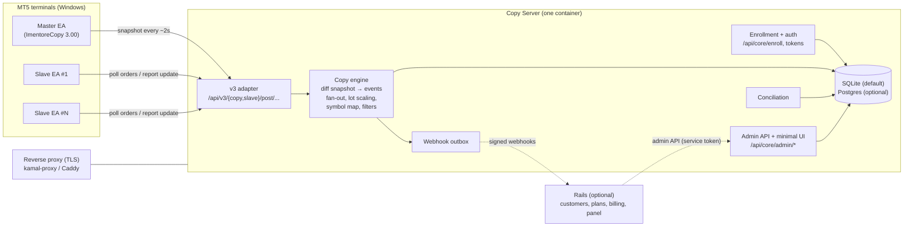

# 0001: Rails-agnostic copy core (standalone Copy Server)

- **Status:** Draft, for review (Phase 0 of #77)
- **Related:** #77 (this design), #78 (rename), #79 (conciliation by ticket), #64 (shared API core), #66 (latency/slippage), brenoperucchi/python-signal#4 (slave symbol mapping)
- **Reviewers:** the mt5 reviewers. Each numbered **Decision (Dn)** below can be approved or rejected on its own.

All code citations are `path:line` against `master` at `1bd5b5b` (this repo) and `main` / PR #4 head of `python-signal`.

---

## 1. Context, goals, non-goals

### 1.1 What exists today

Copy trading runs entirely inside the Rails app:

- The master EA (`ImentoreCopy-3.00-04.mq5`) uploads a JSON snapshot of its positions, pending orders and history every ~2 s (`ImentoreCopy-3.00-04.mq5:69-71`, timer at `:80`), to `POST /api/v3/copy/post/orders/...` (`app/controllers/api/v3/api_copy.rb:15`).
- Rails stores the raw body as a `Message::V3::MetaCopy` (`app/models/message/v3/meta_copy.rb`), then `API::V3::CopyPresenter` diffs it against `Transaction`s and, for every new master ticket, `Model::TraceService#create_order` fans out one `TransactionSlave` per enabled slave account in each trace/store (`app/services/model/trace_service.rb:23-83`).
- Each slave EA polls `POST /api/v3/slave/post/orders/...` (`api_slave.rb:88`), receives a `/`-separated list of pipe-delimited rows (`app/presenters/API/V3/slave_presenter.rb:170-173`, row format in `app/services/trade_helper_service.rb:10-22`), executes locally, and reports each result to `POST /api/v3/slave/post/update/...` with a `metaState` (`api_slave.rb:67`, state machine in `slave_presenter.rb:176-240`).
- Both EAs fetch runtime config from `.../post/store/...` (`api_copy.rb:30-49`, `api_slave.rb:123-141`, `app/presenters/API/V3/store_presenter.rb`).

All of that is entangled with `Store`, `Customer`, `Trace`, `Permission`, `CustomerPlan` and billing (`app/models/account.rb:24-48`, `app/models/trace.rb:22-54`; `Trace` even validates presence of `customer_plans`, `trace.rb:54`). Someone who just wants to copy between their own two accounts must run Rails + Postgres + Redis + seeds (`docker-compose.yml`) and model a "store" and a "plan".

### 1.2 Goals

1. **Individuals first:** one small container that copies trades from one master to N slaves the user owns. No customers, plans or billing required.
2. **Installed EAs keep working.** Phase 1 speaks the existing v3 protocol byte-for-byte where the EA depends on it.
3. **Multi-customer business stays possible** through Rails as an *optional* client of the Copy Server (Phase 3).
4. Fix the known weaknesses before anything is reused: shared secrets compiled into EAs, unauthenticated admin, no TLS, in-memory sessions, JSON-file storage, no tests.

### 1.3 Non-goals (for this design)

- A new EA protocol (v4). We reserve room for it (Section 4.6) but Phase 1 is v3-compatible only.
- MT4, cTrader or other platforms.
- Signal marketplace, Telegram signals (`/api/v3/stores/telegram/python`, `api_store.rb:157`) and billing. These stay in Rails.
- Replacing the EA-side execution logic (retry, slippage, MFE/MAE). The server stays a coordinator; the terminal executes.

---

## 2. Repository consolidation (monorepo)

The owner's direction: merge `python-signal` into the same repo as the Copy Server and the Rails app, done together with the rename (#78).

### D1. Layout

```
<new-name>/
├── ea/                 # from python-signal/MQL (EAs, Lib/*.mqh, JAson)
│   ├── mt5/            #   current maintained EAs only (Copy, Slave, Lib)
│   └── legacy/         #   2.x / 3.00-0[23] kept until tagged, then removed
├── server/             # NEW: Copy Server (FastAPI, Python 3.12)
│   ├── app/  tests/  pyproject.toml  Dockerfile
├── web/                # this Rails app, moved as-is (Gemfile, app/, spec/, config/deploy.yml ...)
├── client/             # python-signal/Python (existing Python client) until retired
├── installer/          # Windows installer (StockInstaller-derived, Section 2.5)
├── docs/               # design docs, protocol reference
├── docker-compose.yml  # server only by default; `--profile web` adds Rails+Postgres+Redis
├── LICENSE.md  CLA.md  README.md
└── .github/workflows/  # one workflow per directory (D3)
```

**Recommendation:** adopt this layout. `web/` is moved, not rewritten.

Alternatives considered:
- *Keep three repos and pin versions.* Rejected: the protocol is the coupling point, and contract tests (Section 4.5) want the EA source, the Rails specs' payloads and the server in one checkout and one PR.
- *Keep Rails at the root and add `server/` + `ea/` beside it.* Less churn now, but makes Rails look like the product when it becomes optional. Acceptable fallback if the move of `web/` is judged too risky for Kamal (`config/deploy.yml` builds from root today).

### D2. History-preserving migration

**Recommendation:** `git filter-repo` on a fresh clone of `python-signal` with `--path MQL/ --path-rename MQL/:ea/` (and `Python/` to `client/`), then `git merge --allow-unrelated-histories` into the target repo. In this repo, move Rails into `web/` with a single plain `git mv` commit (history is still followed with `git log --follow`; `filter-repo` on the main repo is *not* needed and would rewrite every SHA referenced by PRs and issues).

- Authorship is preserved. `python-signal` has 6 commits: 5 by Breno Perucchi and 1 by Oseni Ibrahim (`f2861ab`, symbol mapping, PR #4). Merge PR #4 in `python-signal` **before** the import so Oseni's commit lands with his authorship and his CLA signature remains on record (`cla-signatures` branch exists there).
- `git subtree add` is the alternative. It also keeps history, but in a squashed or prefixed form that is awkward to `blame`, and nothing is gained since we will not sync back.

Old repo: archive `python-signal` (read-only) with a README pointer "moved to `<new-name>/ea`". Leave its releases in place, since installed users may download from them.

### D3. CI per directory

Use `paths:` filters so each job runs only when its tree changes:

| Workflow | Trigger paths | Jobs |
|---|---|---|
| `web.yml` | `web/**` | today's `ci.yml` (RSpec, rubocop), with `working-directory: web` |
| `server.yml` | `server/**`, `web/spec/api/**` | ruff, mypy, pytest (incl. contract tests reading `web/spec/api/v3/*`) |
| `ea.yml` | `ea/**` | syntax/lint only (as `python-signal/.github/workflows/ci.yml` does for Python today); compiling MQL5 needs MetaEditor on Windows, out of scope for CI |
| `docker-publish.yml` | tags + main | two images: `ghcr.io/<owner>/<new-name>-server`, `ghcr.io/<owner>/<new-name>-web` |
| `cla.yml` | PRs | single CLA bot for the whole repo (same `CLA.md`) |

GHCR: keep publishing `ghcr.io/brenoperucchi/mt5-web-replicator` as an alias tag of `-web` for one release, then stop. README badges (`README.md:7`) are regenerated once, after the rename.

### D4. Sequencing relative to the rename (#78)

**Recommendation:** one coordinated change set, in this order:

1. Merge python-signal#4. Tag the last state of both repos (`pre-monorepo`).
2. Rename this repo on GitHub (redirects are automatic), rename the image.
3. Import `python-signal` into `ea/` + `client/` (D2), move Rails to `web/`, split CI (D3). One PR, reviewed as "moves only".
4. Rename the EA files and `Imentore*` identifiers in a **separate** PR, so the move PR stays a pure move. The URL segment `imentore_copy`/`imentore_slave` stays accepted by the server forever (it is in every installed EA's request path, `ImentoreLib-13.mqh:241-242`, and in `config/meta_versions.yml`).
5. Archive `python-signal`.

Phase 1 server work can start in parallel on a branch under `server/` once step 3 lands. It does not depend on step 4.

---

## 3. Copy Server architecture

### 3.1 Components



- **v3 adapter:** parses the multipart `data` file or `orders` field exactly like `app/controllers/api/v3/defaults.rb:31-51` (NUL stripping, Latin-1 to UTF-8 fallback), resolves the account from the path, and translates it into core commands. It owns all v3 quirks (pipe rows, `201` + plain text).
- **Copy engine:** pure Python, no I/O framework imports. Input: a snapshot or a slave report. Output: state changes and outbound "slave orders". This is the piece #64 asks for in Rails (`app/services/copy/*`); here it is born separate.
- **Conciliation:** the history-based reconciliation now in `CopyConciliatePresenter`/`SlaveConciliatePresenter` (~840 lines), rewritten against ticket identity (Section 7).
- **Webhook outbox:** events persisted in the same transaction as the state change, delivered asynchronously with retry (Section 8).

### D5. Language and framework: Python 3.12 + FastAPI

**Recommendation:** FastAPI + Pydantic v2 + SQLAlchemy 2 (sync engine) + Alembic, served by uvicorn.

Why:
- The owner already runs a FastAPI license server with the handshake we want to reuse (`MT5Dividend/vendor/server/main.py:399` authenticate, `:491` validate, `:579` revoke) and per-account config resolution (`get_account_config`, `main.py:267`). Patterns and operator knowledge carry over.
- `python-signal` already has a Python client, so the monorepo stays two languages (Ruby, Python) plus MQL.
- Pydantic models give us the protocol schema as code, which the contract tests and a future v4 OpenAPI doc both use.
- The load is small: one master at 0.5 req/s plus N slaves at 0.5–1 req/s each. Python is not a bottleneck; the DB write path is.

Alternatives: *Go* (single static binary, faster) was rejected for now because nobody maintains Go here and the reusable code is Python. *Keep it in Rails and make Rails slim* (#64 only) does not meet goal 1. *Litestar/Flask* offer no advantage over the FastAPI code we already have.

Sync SQLAlchemy is deliberate: SQLite write serialization makes async DB access pointless, and sync code is easier to test.

### D6. Persistence: SQLite by default, Postgres optional

**Recommendation:** SQLAlchemy models with SQLite in WAL mode (`/data/copy.db` on a Docker volume) as default; `DATABASE_URL=postgresql://...` switches to Postgres. CI runs the test suite on both.

- One master and a handful of slaves produce a few writes per second. SQLite in WAL with `busy_timeout` handles that with headroom, and it is one file to back up.
- Postgres for people who run many masters, or who run it next to Rails anyway.

**Why not JSON files** (what `main.py` does, `:184-206`, read-modify-write of `accounts.json` on every admin call): no atomicity across the snapshot→fan-out step, lost updates under concurrent requests (uvicorn workers), no unique constraints for idempotency, no indexes for ticket lookups. The copy path needs exactly those guarantees.

Single process writer: run uvicorn with **one worker** on SQLite (documented and enforced at startup); multiple workers only with Postgres.

### D7. Deployment and configuration

- One Docker image `server/Dockerfile` (python:3.12-slim, non-root, `HEALTHCHECK` on `/healthz`).
- Root `docker-compose.yml`: service `copy-server` plus volume `copy-data`. `--profile web` adds today's Rails stack, unchanged.
- TLS is terminated by a reverse proxy (Section 6.2); the container listens on plain HTTP inside the network only.
- Configuration by environment only (12-factor). No secrets in images or code:

| Var | Default | Notes |
|---|---|---|
| `DATABASE_URL` | `sqlite:////data/copy.db` | |
| `ADMIN_TOKEN` | *(required, no default)* | bootstrap admin credential; refuse to start if unset outside `ENV=dev` |
| `TOKEN_PEPPER` | *(required)* | HMAC key for hashing account tokens at rest |
| `V3_COMPAT_MODE` | `open` | `open` = accept unauthenticated v3 like today; `enrolled` = require a known, enabled account (Section 6) |
| `WEBHOOK_URL`, `WEBHOOK_SECRET` | unset | Rails integration, optional |
| `PUBLIC_HOSTNAME` | unset | returned as `api_server_hostname` in store config |

---

## 4. Protocol compatibility (Phase 1)

### 4.1 Transport facts the EAs rely on

From `ImentoreLib-13.mqh:223-300` (`ApiData`):

- **Always `POST`**, `multipart/form-data` with a fixed boundary, one part named `data` with a `filename` and `Content-Type: text/html; charset=utf-8` (`:229-238`). The JSON is the *file content*. Rails also accepts a form field `orders` (`defaults.rb:37`); the server must accept both.
- **No auth header, no cookie, no token.** Identity is entirely the URL path (`:241-242`):
  `{apiServerUrl}/api/{apiVersion}/{copy|slave}/post/{name}/{expert_name}/{expert_version}/{account_server}/{login}/{HEDGING|NETTING}`.
- `apiServerUrl` is **compiled in** (`ImentoreLib-13.mqh:1740-1746`): `localhost:8080`/`:8081` when `InputEnvironmentLocal`, otherwise a fixed HTTPS host. Pointing an installed EA at a new server therefore requires DNS (keep the hostname) or a rebuild. This matters for migration (Section 9).
- Status handling: **only `201` is success** (`:290-292`) and the body is then split on `/` into `ResponseData`. `403` = "account disabled" message (`:285-289`). `-1` = URL not whitelisted in MT5. Any other code (including `200`!) is treated as failure and retried with backoff, up to 10 s between attempts (`:247-258`).
- 5 s request timeout (`:225`).

### 4.2 Endpoints to implement

| # | Method + path (after `/api/v3`) | EA caller | Request | Success response | Failure codes | Source |
|---|---|---|---|---|---|---|
| E1 | `POST copy/post/orders/:expert/:ver/:server/:login/:mode` | master, every ~2 s and on trade events (`ImentoreCopy-3.00-04.mq5:93,332,352,573`) | `{HistoryOrders[], PositionOrders[], PendingOrders[], ApiSendOrdersHistory?}` | `201`, body `true` | `400` if account unknown/disabled or processing failed | `api_copy.rb:15-26` |
| E2 | `POST\|GET copy/post/store/...` | master on init and every `api_time_to_check_server` | none | `201` + JSON object (AccountSerializer attributes) | `401` store disabled or EA version not accepted, `403` account not found/disabled | `api_copy.rb:30-49`, `store_presenter.rb:277-294` |
| E3 | `POST slave/post/orders/...` | slave poll (`ImentoreSlave-3.00-04.mq5:99,176`) | slave snapshot (same JSON shape; history used for conciliation) | `201` + pipe rows joined by `/` | `400` | `api_slave.rb:88-100`, `slave_presenter.rb:170-173` |
| E4 | `GET slave/post/orders/...` | legacy, same as E3 | | same | `400` | `api_slave.rb:104-120` |
| E5 | `POST slave/post/update/...` | slave after each action (`ImentoreSlave-3.00-04.mq5:1529`) | one order object incl. `metaState`, `comment`, `positionID`, `ticketDeal`, `volume`, prices | `201` + pipe rows (same as E3) | `400` | `api_slave.rb:67-84` |
| E6 | `POST\|GET slave/post/store/...` | slave config | | as E2 | as E2 | `api_slave.rb:123-141` |
| E7 | `GET stores/config/...` | older EAs | | JSON | `400` | `api_store.rb:165-173` |
| E8 | `POST {copy\|slave}/post/{LogFileName}/...` | EA log upload (`ImentoreLib-13.mqh:992`) | log text | none exists in Rails today: returns 404/405 | | **new**: accept and store with size cap, or keep returning 404 (open question Q6) |

Not ported: `GET stores/telegram/python` (Rails-only feature).

### 4.3 The slave row format (E3/E5 body)

Rows are joined with `/` and each row is 18 pipe-separated fields (`trade_helper_service.rb:21`); the EA requires at least 17 (`ImentoreLib-13.mqh:1288`):

```
0 ordertype | 1 ticket_master | 2 ticket_slave | 3 trace_id | 4 slave_id | 5 magic_number |
6 master_id | 7 price_open ("0" for market) | 8 lot | 9 stop_loss | 10 take_profit | 11 state |
12 symbol | 13 ticket_deal | 14 seconds_ago | 15 comment | 16 open_at (epoch) | 17 contract_volume
```

Server-side invariants to preserve:
- Rows include slaves in `opened` scope with a master link, closed within the last 31 days or still open (`slave_presenter.rb:171`).
- `comment` is `"{trace_id}-{ticket_master}"` (`trace_service.rb:65`); for prop-firm traces it is prefixed `"{account_id}{magic}_"` and the magic is rewritten (`trace_service.rb:70-73`). Slaves report back by this comment and the server finds the slave by it (`slave_presenter.rb:183`). **The comment is the de-facto correlation key in v3.**
- Lot: the server sends the master `volume` as-is (`slave_serializer.rb:83-85`) plus `contract_volume`. The EA computes `min_lot * contract_volume` when `contract_volume != 0`, else uses the master lot (`ImentoreSlave-3.00-04.mq5:1481-1488`). Phase 1 keeps this split; Phase 2 moves scaling server-side (Section 5.3) and sends `contract_volume=0` with an already-scaled lot.
- `/` and `|` inside symbol or comment break the format. Today nothing escapes them; the server will reject such values on input.

### 4.4 Server-side behavior to preserve

| Behavior | Today | Where |
|---|---|---|
| Account lookup by `(account_server lower-cased, login, kind, enabled)`; unknown server names are auto-created | `find_or_create_by(name: ...downcase)` | `api_copy.rb:17-18` |
| Store config binds a server to an account seen first without one | `account_server: nil` then update | `store_presenter.rb:260-264` |
| EA version gate | `config/meta_versions.yml` by `expert_name` + first 4 chars of version | `defaults.rb:24-29` |
| New master ticket → one order per trace/store, one slave row per enabled slave | `create_order` | `trace_service.rb:23-83` |
| Netting accounts: one order per symbol; skip fan-out if slaves exist | | `trace_service.rb:26-32,61` |
| SL/TP/price/profit change on an open master position → `MODIFY` on master transaction, slaves pick it up via row fields | | `copy_presenter.rb:39-53` |
| Master position gone + in history → close master, mark slaves for close | three closing mechanisms | `copy_presenter.rb:98-156`, `:66-89` for pendings |
| Magic number allow-list per trace and per account blocks fan-out | `resource_restricted?` | `trade_helper_service.rb:26-50`, `trace_service.rb:60` |
| Instrument rename per slave account when `instrument_control` | `check_instrument` | `trace_service.rb:90-96` |
| Slave `metaState` handling: `OPEN/OPENED` execute, `CLOSED/HASCLOSED` close, `DELETED`, `MODIFY`, `NOTMODIFY` (escalates to `NOSLTP` after 2/day), `NOTFIND`/`ERRORDEAL`/`TIMEMAX`/`REACHMFE`/`REACHLOSS` → error | | `slave_presenter.rb:194-235` |
| Duplicate cleanup by comment | `check_order_duplicate` destroys duplicates | `slave_presenter.rb:242-254` |
| `ApiSendOrdersHistory: true` triggers full conciliation, then turns the flag off | | `slave_conciliate_presenter.rb:13-24` |
| Every request stored raw before processing | `Message::V3::MetaCopy.create(content:, params:, request_url:)` | `api_copy.rb:19` |

Behaviors we propose **not** to copy (each needs reviewer sign-off):
- `meta_version_accept` checks `.present?`, so a version marked `disable` in `meta_versions.yml` is still accepted (`defaults.rb:28`, yaml values like `'2_30': disable`). The server will treat `disable` as rejected. Confirm that's intended (Q5).
- `check_order_duplicate` hard-deletes rows (`destroy_all`). The server will mark them `superseded` and keep them in the audit log.
- Failures inside `MetaSlave#execute` are swallowed and return `400` with no body (`api_slave.rb:79-81`). The server will log the exception with the message id.

### 4.5 Contract (golden) tests

Goal: **same input → same resulting state and response**, Rails vs. Copy Server.

1. **Fixtures:** reuse `spec/api/v3/orders_history.txt` (266 lines, real EA payload), `spec/api/v2/orders_history.json`, and the inline payloads in `spec/api/v2/api_copy_orders_spec.rb`, `api_copy_hedging*_spec.rb`, `api_slave_spec.rb`, `spec/api/v3/api_magic_number_restrictions_spec.rb`. Move them to `docs/protocol/v3/fixtures/` (shared by `web/` and `server/`); the Rails specs read from there.
2. **Recorder (one-off, in `web/`):** a rake task that runs each scenario through the Rails stack (the same way `db/seeds/demo.rb` feeds `Message::V3::MetaCopy`/`MetaSlave`) and writes a normalized **golden file** per step: HTTP status, response body (pipe rows parsed into fields), and a projection of state (`Transaction`, `TransactionSlave` keyed by ticket and comment: state, lot, symbol, SL/TP, closed?).
3. **Server tests** replay the same steps against the FastAPI `TestClient` and compare with the golden files. Non-deterministic fields (ids, timestamps, `seconds_ago`, `open_at`; Rails already zeroes `open_at` in test, `trade_helper_service.rb:18`) are masked.
4. Golden files are checked in. A deliberate behavior change (Section 4.4 "not copied" list) updates the golden file in the same PR, so the diff is reviewable.

Exit criterion for Phase 1: all golden scenarios pass, plus E2E with a real master and slave on a demo broker.

### 4.6 Room for v4

Core endpoints live under `/api/core/...` (JSON, bearer token, idempotency key header). A future EA can speak those directly; v3 stays an adapter. Not designed further here.

---

## 5. Data model for the core

### 5.1 Tables

```
accounts            id, broker_server, login, role(master|slave), margin_mode(hedging|netting),
                    label, enabled, ea_name, ea_version, last_seen_at, token_hash, token_issued_at,
                    UNIQUE(broker_server_norm, login, role)
copy_links          id, master_id → accounts, slave_id → accounts, enabled,
                    lot_mode(master|multiplier|fixed|min_lot_x), lot_value,
                    symbol_filter(json allow/deny), magic_allow(json), magic_mode(same|fixed),
                    magic_value, comment_prefix, max_slippage_points, copy_pending, copy_sl_tp,
                    UNIQUE(master_id, slave_id)
symbol_maps         id, slave_id (nullable = global), master_symbol, slave_symbol,
                    UNIQUE(slave_id, master_symbol)
master_positions    id, master_id, ticket(position id), symbol, type, volume, price_open, sl, tp,
                    magic, state(open|pending|closed), opened_at, closed_at, last_snapshot_id,
                    UNIQUE(master_id, ticket)
slave_orders        id, link_id → copy_links, master_position_id, slave_id,
                    correlation (v3 comment "{link}-{ticket}"), symbol_master, symbol_local,
                    lot, sl, tp, state(pending|executed|closing|closed|deleted|error|superseded),
                    ticket_slave(position id), ticket_deal, price_open, price_close, profit, fee,
                    last_meta_state, opened_at, closed_at, conciliated_at,
                    latency_ms, slippage_points (for #66),
                    UNIQUE(link_id, master_position_id), UNIQUE(slave_id, ticket_slave)
inbound_messages    id, account_id, kind(copy_snapshot|slave_poll|slave_update|store|log),
                    request_path, content (raw), content_sha256, received_at,
                    state(pending|executed|error), error
events (outbox)     id, type, payload(json), created_at, delivered_at, attempts
admin_users / api_tokens   id, name, token_hash, scopes, created_at, revoked_at
```

Mapping from Rails:

| Rails | Core | Note |
|---|---|---|
| `Account` (`kind: copy/slave`, `meta_margin_mode`, `account.rb:14-18`) | `accounts` | `store`, `customer` dropped |
| `Trace` + `Permission` + `StoreTrace` | `copy_links` (pairwise) | a trace is "one master → many slaves with shared settings"; Rails can keep traces and sync them as links |
| `Trace`/`Account` settings `magics_accept`, `instrument_control`, `magic_same`, `kind_copy: prop_firm`, `contract_volume` | columns on `copy_links` | |
| `Instrument` (`account.rb:39`, `check_instrument`) | `symbol_maps` | |
| `MagicNumber` (`trace.rb:47`) | `copy_links.magic_allow` | |
| `Order` + `Transaction` | `master_positions` | `Order` exists for the store/billing fan-out; the core does not need it |
| `TransactionSlave` | `slave_orders` | |
| `Message::Message` (`messages` table) | `inbound_messages` | |
| `Logging` | `events` + structured logs | |

### 5.2 Lifecycle

```
master snapshot ─► diff vs master_positions
   new ticket          → master_positions(open) + slave_orders(pending) per enabled link
   changed SL/TP       → update; slave rows carry new SL/TP (v3 EA reacts with MODIFY)
   gone + in history   → master_positions(closed); slave_orders(executed) → closing
slave update ─► by correlation:
   OPEN/OPENED         → executed (store ticket_slave, price_open, latency, slippage)
   CLOSED/HASCLOSED    → closed
   DELETED             → deleted
   NOTFIND/ERRORDEAL/TIMEMAX/REACH* → error
   MODIFY/NOTMODIFY/NOSLTP/NOTCLOSED → audit only (+ escalation rule)
```

Hedging vs netting: on hedging accounts a master position id maps to one slave position. On netting masters (`trace_service.rb:26-32`), the master reports one position per symbol whose volume changes; Phase 1 reproduces today's behavior (one slave order per symbol, no re-sizing on partial adds). Partial close/add for netting is listed as a Phase 2 item (Q7).

### 5.3 Lot scaling (Phase 2)

`lot_mode`: `master` (copy volume), `multiplier` (volume × k), `fixed`, `min_lot_x` (today's `contract_volume`). Rounding to the slave's `volume_step`/`volume_min` needs symbol specs the server does not have; v3 slaves keep rounding locally (`NormalizeVolume`), so the server sends the unrounded value with `contract_volume=0`. Default stays `min_lot_x` for migrated data so behavior is unchanged.

### 5.4 Idempotency

- **Snapshots are naturally idempotent:** they are full state, so reprocessing the same snapshot changes nothing. We enforce it with `UNIQUE(master_id, ticket)` on `master_positions` and `UNIQUE(link_id, master_position_id)` on `slave_orders`, inserting with `ON CONFLICT DO NOTHING`. This replaces the `RecordNotUnique` rescue in `copy_presenter.rb:34`.
- **Slave updates** are keyed by `(slave_id, correlation, metaState, ticket_slave)`; state transitions are monotonic (an `executed` row never goes back to `pending`), so a retried `OPEN` is a no-op.
- Each request runs in **one DB transaction** (diff + fan-out + outbox insert). Today a crash between creating the `Transaction` and the slaves leaves partial state (`trace_service.rb:31-80` is not wrapped in a transaction).
- `content_sha256` on `inbound_messages` lets us drop byte-identical master snapshots received within the same second (the EA sends on timer *and* on trade events) without processing them twice.
- v4 / admin API: `Idempotency-Key` header, stored 24 h. Pattern borrowed from the deterministic execution ids in `stock-dividend/mcp_mt5_sync/service.py:257-265`.

### 5.5 Audit log

Every inbound request is stored raw before processing (as `api_copy.rb:19` does today), with the path and a hash. Retention: 30 days by default (`AUDIT_RETENTION_DAYS`), pruned daily; slave/master rows keep a pointer to the message that last changed them. This keeps the debugging power of today's `Message` + `Logging` without unbounded growth on SQLite.

---

## 6. Auth and security

### 6.1 Today

- Rails v3 endpoints: **no authentication.** Anyone who knows a login number and broker name can post snapshots for a master (`api_copy.rb:17-18`) or read a slave's pending orders.
- MT5Dividend license server: `auth_hash = SHA256(account_number + SERVER_SECRET)` with the secret **hardcoded in the EA** (`EA/Include/RemoteLicense.mqh:66-67`; server side from env, `main.py:26`, which falls back to a placeholder default). Any decompiled `.ex5` reveals it and lets anyone forge any account. Sessions are an in-memory dict (`main.py:93`), lost on restart; admin routes (`main.py:625-771`) have no auth; CORS `*` (`main.py:59-66`); plain HTTP URLs (`RemoteLicense.mqh:30-31`).

### D8. Per-account tokens with enrollment

**Recommendation:**

1. Admin creates an account (or a link) and the server issues a **one-time enrollment code** (short, e.g. 8 chars, 15-minute TTL).
2. The user pastes the code into the EA input (`InputEnrollCode`). The EA calls `POST /api/core/enroll {code, broker_server, login, role, margin_mode}` once.
3. The server binds the code to that `(broker_server, login)` and returns a random 256-bit **account token**. The EA stores it in a terminal global/file (`FILE_COMMON`), never in the source. The server stores only `HMAC(TOKEN_PEPPER, token)`.
4. Subsequent requests send `Authorization: Bearer <token>`. MQL `WebRequest` supports custom headers, so the existing multipart body is unchanged.
5. Rotation: `POST /api/core/token/rotate`; revocation from admin. Short-lived session tokens (the `authenticate → validate` dance in `main.py`) are unnecessary once the long-lived token is unique per account and revocable; we keep the "validate" idea as the periodic store-config call (E2).

Transition for installed v3 EAs (which cannot send a header): `V3_COMPAT_MODE=open` accepts header-less v3 requests **only for accounts that exist and are enabled** (today's rule). An admin can switch an account to `token_required` once it runs a new EA build. New installs default to `enrolled`.

Alternatives: *keep a shared secret but per-build*: still extractable. *mTLS*: MT5 `WebRequest` cannot present client certs. *OAuth device flow*: same shape as the enrollment code but more moving parts.

### 6.2 TLS

The server does not terminate TLS. Production: behind kamal-proxy (already used for Rails, `config/deploy.yml`) or Caddy with automatic certificates. MT5 `WebRequest` requires the URL to be whitelisted and handles HTTPS natively. Docs will state that plain HTTP is for `localhost` only. Local trials keep `http://localhost:8080/8081`, matching `ImentoreLib-13.mqh:1741-1744`.

### 6.3 Admin auth

- `/api/core/admin/*` requires a bearer admin token (`api_tokens`, scoped `admin` or `readonly`). The first one comes from `ADMIN_TOKEN` env; the server refuses to start without it outside dev.
- Rails (Phase 3) gets its own scoped service token.
- No CORS by default; the minimal admin UI is served same-origin.

### 6.4 Rate limiting and input limits

- Per account: 10 req/s burst, 5 req/s sustained (the EA's normal rate is ≤1 req/s; retries back off to 10 s, `ImentoreLib-13.mqh:247-252`). Per IP for unauthenticated/enroll: 10/min.
- Body cap 2 MB (a full-history snapshot is the large case; `orders_history.txt` is ~8 KB for a few dozen deals). Log uploads (E8) capped separately.
- In-process limiter (slowapi or a token bucket in SQLite) is enough for one container; the proxy can add more.

### 6.5 Secrets

All secrets via env or Docker secrets (`ADMIN_TOKEN`, `TOKEN_PEPPER`, `WEBHOOK_SECRET`, `DATABASE_URL`). Nothing in images or EA source. The hardcoded secret in `RemoteLicense.mqh:67` must be rotated on the MT5Dividend server whatever happens to this design, since it is in git history.

---

## 7. Conciliation and symbol mapping

### 7.1 Symbol mapping (python-signal#4)

PR #4 resolves symbols **on the slave** (mapping input, prefix/suffix, auto-detect; `ImentoreSlave-3.00-04.mq5:30-33`, `ResolveSlaveSymbol` used at `ImentoreLib-13.mqh:1291`). That is the right place for *discovery*, since only the terminal knows which symbols its broker has.

**Recommendation (D9):** two layers, server wins when set:
1. Server `symbol_maps` (per slave, or global) is applied before the row is sent: field 12 carries the slave symbol. Admin-managed, visible, auditable. Replaces Rails `Instrument` + `instrument_control` (`trace_service.rb:90-96`).
2. EA-side resolution (PR #4) stays as fallback for anything the server did not map. Since it receives an already-mapped name, an exact match short-circuits it.
3. The slave reports the resolved local symbol in its update; the server stores it as `slave_orders.symbol_local`. Later a v4 EA can upload its symbol list and the server can suggest maps.

### 7.2 Conciliation (#79)

The bug: `SlaveConciliatePresenter#conciliate_position` matches by `symbol` + `ticket_slave` (`slave_conciliate_presenter.rb:128`), but `symbol` is the master symbol and history reports the local one, so mapped copies never match.

**Recommendation (D10):** in the core, conciliation matches **only by identity**: `(slave_id, ticket_slave)` (position id), falling back to `correlation` (comment) when the ticket is not yet known. Symbol is compared only as a consistency check, logged on mismatch. `UNIQUE(slave_id, ticket_slave)` makes this the natural key.

Also fix #79 in Rails *now*, independently (match by `ticket_slave` + `account`, add a `symbol_local` column, regression spec where history reports `GOLD` for master `XAUUSD`), because Rails is the running backend until Phase 3, and PR #4 will hit it first. The same fixture then becomes a golden test (Section 4.5), where the Rails behavior after the fix is the golden one.

Conciliation also computes latency (`slave open_at − master open_at`, both normalized via `time_gmt`) and slippage (`slave price_open − master price_open` in points) and stores them on `slave_orders` (#66). Time-zone handling follows `slave_serializer.rb:147-160`.

---

## 8. Rails as an optional module

### D11. Contract

**Recommendation:** Rails becomes a client of the Copy Server; the Copy Server never calls into Rails for authorization on the hot path.

- **Copy Server → Rails: signed webhooks** from the outbox (`account.seen`, `master_position.opened/closed`, `slave_order.executed/closed/error`, `conciliation.completed`). HMAC-SHA256 signature header, at-least-once delivery, retries with exponential backoff (shape from `stock-dividend/mcp_mt5_sync/service.py:128-160`), event id for dedupe on the Rails side.
- **Rails → Copy Server: admin API** with a service token: create/enable/disable accounts and links, set lot/symbol/magic settings, issue enrollment codes, read positions and history for the panel.
- **Authorization (plans, billing):** Rails decides and *pushes* the result (`PATCH /admin/accounts/:id {enabled: false}` when an invoice is unpaid). No synchronous "may this account copy?" call per EA request, so a Rails outage does not stop copying. Alternative considered: Copy Server calls a Rails `authorize` endpoint with a cache. Rejected because it puts Rails back on the critical path.

### What moves out of Rails, what stays

| Moves to Copy Server | Stays in Rails |
|---|---|
| `app/controllers/api/v3/*` copy/slave/store endpoints | `Customer`, `User`, `Store` (as tenant), `Plan`, `CustomerPlan`, `Invoice`, Stripe |
| `CopyPresenter`, `SlavePresenter`, `*ConciliatePresenter`, `TraceService`, v3 serializers | Admin, control and panel UIs (read from Copy Server API or from webhook-fed tables) |
| `Message::V3::*` raw storage | Telegram signals (`stores/telegram/python`), `BotTelegram` |
| `config/meta_versions.yml` (EA version gate) | Statistics/reports derived from webhook data |
| v1/v2 APIs: **not ported** (see Q4) | v1/v2 endpoints until retired |

Rails keeps `Trace` as the commercial product ("a signal you subscribe to"); subscribing an account creates a `copy_link` via the admin API.

---

## 9. Migration plan and phases

| Phase | Scope | Exit criteria |
|---|---|---|
| **0** | This document approved; #79 fixed in Rails; python-signal#4 merged | Decisions D1–D11 approved or amended; open questions answered or deferred explicitly |
| **0.5** | Monorepo + rename (D1–D4) | One repo, CI green for `web/`, `ea/`; `python-signal` archived; Rails image still deploys |
| **1** | Copy Server core: E1–E7, accounts/links/master_positions/slave_orders, SQLite, Docker, admin API (token), golden tests | All golden scenarios pass; demo master + 2 slaves (hedging and netting) copy, modify and close for 48 h on a demo broker with zero unmatched slaves; `docker compose up` gives a working server with no Rails |
| **2** | Server-side symbol maps, lot modes, conciliation by ticket, latency/slippage, enrollment + tokens in a new EA build | Golden tests updated deliberately; #66 numbers visible via API; a new EA build passes enrollment; mapped-symbol conciliation scenario passes |
| **3** | Rails as client: webhooks + admin API; Rails' v3 endpoints removed or proxied | Rails panel shows positions from the Copy Server; disabling a plan disables copying within one webhook/admin round trip; Rails can be stopped without affecting copying |

### Existing deployments and data

There are no active deployments today, so no live cutover is needed. Still provided:
- `server/scripts/import_from_rails.py`: reads Rails Postgres (`accounts`, `traces`, `permissions`, `instruments`, `magic_numbers`, open `transactions`/`transaction_slaves`) and writes core rows, mapping each `(trace, master account, slave account)` permission triple to a `copy_link`. Closed history is optional (`--with-history`).
- `db/seeds/demo.rb` gets a twin in `server/` so the local trial has the same demo data.

### Rollback

- Phases 0.5 to 2: Rails remains fully functional, and the EA's server URL (`ImentoreLib-13.mqh:1746`, or DNS) decides which backend is used. Rollback = point DNS/proxy back to Rails.
- The importer is one-way. For the rollback window, run in shadow mode: the proxy mirrors master snapshots to the Copy Server (responses ignored) and the golden comparison runs on real traffic for a week before switching.
- Phase 3 is reversible as long as Rails' v3 code is deleted only one release after cutover.

---

## 10. Risks and open questions

### Risks

- **R1. Hidden v3 behavior.** The presenters encode years of edge cases (duplicate cleanup, `NOTMODIFY` escalation, three closing mechanisms). Golden tests only cover recorded scenarios. Mitigation: shadow mode on real traffic before cutover; port the scenario list from all `spec/api/v2|v3` files, not only v3.
- **R2. Compiled-in server URL.** Installed EAs can only be redirected by DNS. If the old hostname is gone, users need a new build anyway, which weakens the "installed EAs keep working" goal in practice.
- **R3. Comment as correlation key.** MT5 brokers may truncate comments (31 chars) or overwrite them; prop-firm prefixes make them longer (`trace_service.rb:71`). Today's design has the same risk; the core reduces reliance on it once `ticket_slave` is known.
- **R4. SQLite with multiple workers.** Mitigated by refusing to start with >1 worker on SQLite.
- **R5. Monorepo move breaks Kamal/CI paths** (`config/deploy.yml`, Dockerfile context). Mitigation: the move PR changes paths only, and a deploy dry-run is part of its checklist.
- **R6. Licensing.** Both repos use PolyForm Noncommercial + CLA; Oseni's contribution was made under python-signal's CLA. Confirm the CLA wording covers relocation into a renamed repo (it should, since it grants rights to the maintainer, not to a repo).

### Open questions (for the owner and reviewers)

- **Q1.** New project name (#78). It blocks D4 step 2 but not Phase 1 code.
- **Q2.** Are any EA builds older than 3.00 still installed anywhere? If not, the server implements v3 only and `web/` can drop v1/v2 (#64).
- **Q3.** Keep the production hostname of `ImentoreLib-13.mqh:1746` alive (DNS to the Copy Server) or accept that all users reinstall a renamed EA? This decides how much effort `V3_COMPAT_MODE=open` deserves.
- **Q4.** Is pairwise `copy_links` acceptable as the core model, with "trace" kept only as a Rails concept? Or should the core have a first-class "group" (one master, shared settings, many slaves)?
- **Q5.** `meta_versions.yml` `disable` entries are accepted today because of the `.present?` check (`defaults.rb:28`). Is enforcing them in the Copy Server the intended behavior?
- **Q6.** EA log upload (E8, `ImentoreLib-13.mqh:992`) has no Rails route. Implement a log sink in the server, or drop the call in the next EA build?
- **Q7.** Netting partial adds/closes: mirror proportionally on slaves in Phase 2, or keep today's "one slave order per symbol" behavior?
- **Q8.** Lot scaling server-side vs. EA-side: OK to keep EA-side rounding (the server lacks `volume_step`) and only move the *policy* to the server?
- **Q9.** Should the minimal admin UI in the Copy Server be a few server-rendered pages, or API-only with Rails/CLI as the UI?
- **Q10.** Reuse StockInstaller (C#/.NET 8, `MT5Dividend/StockInstaller/src`, GitHub releases updater in `Services/GitHubService.cs`) for the copy EAs in `installer/`, or keep installation manual until Phase 2?
- **Q11.** Does the MT5Dividend license server (`main.py`) get migrated onto the same account/token model later (shared `server/` auth package), or stay separate?

---

## Decision summary

| # | Decision | Recommendation |
|---|---|---|
| D1 | Repo layout | Monorepo: `ea/ server/ web/ client/ installer/ docs/` |
| D2 | History migration | `git filter-repo` import of python-signal + `git mv` Rails to `web/`; merge PR #4 first |
| D3 | CI | Path-filtered workflows per directory, one CLA bot, two GHCR images |
| D4 | Sequencing | Tag → rename → move PR → EA rename PR → archive; Phase 1 in parallel after move |
| D5 | Stack | Python 3.12, FastAPI, Pydantic v2, SQLAlchemy 2 (sync), Alembic |
| D6 | Storage | SQLite WAL default, Postgres optional; never JSON files |
| D7 | Deploy/config | Single image, compose, env-only config, TLS at proxy |
| D8 | Auth | Per-account tokens via one-time enrollment code; v3 compat mode for old EAs; admin bearer tokens |
| D9 | Symbol mapping | Server `symbol_maps` first, EA-side PR #4 as fallback |
| D10 | Conciliation | Match by `ticket_slave` / correlation, never symbol; fix #79 in Rails now |
| D11 | Rails contract | Webhooks out + admin API in; Rails pushes authorization, never on the hot path |
