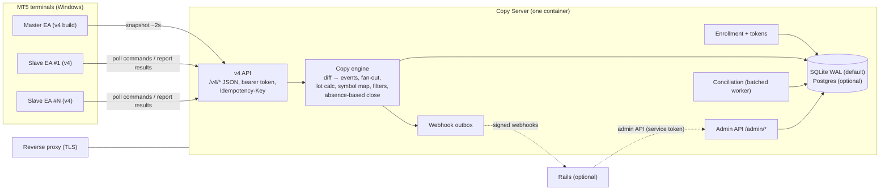

# 0001: Rails-agnostic copy core (standalone Copy Server)

- **Status:** Draft, revision 2 (after review round mt5-3), Phase 0 of #77
- **Related:** #77 (this design), #78 (rename), #79 (conciliation by ticket), #64 (shared API core), #66 (latency/slippage)
- **Reviewers:** the mt5 reviewers. Each numbered **Decision (Dn)** below can be approved or rejected on its own.

Rails citations are `path:line` against `master` at `4e64c5e`; EA citations against `python-signal` `main` at `2e7b827` (`EA/` = `MQL/Imentore/MT5/`, `Lib` = `EA/Lib/ImentoreLib-13.mqh`, `Slave` = `EA/ImentoreSlave-3.00-04.mq5`).

---

## 0. Changes since review mt5-3

Owner decisions of 2026-10-04 changed the premise. python-signal is not imported (new EA and server are written here; python-signal is archived as legacy), and **no EA is installed or pointing at a live server.** v3 wire compatibility is dropped. The Copy Server speaks a new **v4** protocol (Section 4) with a new EA build; v3 is kept only as a reference for business rules (Section 5.5, Appendix A). Netting is limited to one copy per symbol per slave in Phase 1; lots are computed server-side from symbol specs the EA reports; market orders execute at market on both sides.

| Finding | Resolution |
|---|---|
| rev-1 #1 (`state=close` ignored by EA) | Obsolete as wire issue: v4 sends explicit `action: close` commands (4.4). The legacy `pending/executed/remove` vocabulary is recorded in Appendix A. |
| rev-1 #2 (lot rounding does not exist) | Decision 4: EA reports `volume_min/step/max`, `contract_size`; server rounds down to step, clamps (5.4). |
| rev-1 #3 (ticket mixes identities) | Identity model with order / deal / position ticket / `position_id` (5.2); netting per decision 3. |
| rev-1 #4 (`copy_links` loses trace) | `copy_groups` + `UNIQUE(group_id, master_id, slave_id)` (5.1). |
| rev-1 #5 (`enrolled` semantics) | No open/legacy mode; bearer token always required (6.2). `V3_COMPAT_MODE` removed. |
| rev-1 #6 (IP rate limit blocks polling) | Per-route/role limits sized for 2 s polling of many terminals behind one IP; strict only for enroll/unknown (6.4). |
| rev-1 #7 (PR #4 symbol precedence) | Obsolete: the new EA does no local mapping; it trades the symbol the server sends, exact name only (7.1). |
| rev-1 #8 (one worker ≠ serialization) | `BEGIN IMMEDIATE` writes, busy_timeout, whole-transaction retry, conciliation off hot path (D6). |
| rev-1 #9 (dedup drops legit updates) | Idempotency keys from the EA + transition idempotency only for terminal states (5.6). |
| rev-1 #10, #11 (golden masking / recorder) | Obsolete: no byte-level golden recorder. Rails specs become behavior scenarios (8). |
| rev-1 #12 (CI path filters) | `server.yml` triggers on `docs/protocol/**`, `ea/**` contract sources, `web/` API sources (D3). |
| rev-1 #13 (catalog errors) | Moved to Appendix A as legacy facts (18 fields, field 4 = `TransactionSlave.id`, timeout `0`, E1 500). |
| rev-2 A1 (non-201 loops forever) | Documented as legacy EA defect (Appendix A); v4 EA has bounded retries and 4xx/5xx handling (4.2). "201 always" not adopted. |
| rev-2 A2 (field 11 vocabulary) | As rev-1 #1. |
| rev-2 A3 (lot premise, netting resizing) | Decision 4 (5.4); netting decision 3 (5.3). Today's 1:1 resize is described in Appendix A. |
| rev-2 A4 (store JSON byte limits) | Obsolete: v4 config is real JSON parsed by a JSON library in the EA. |
| rev-2 A5 (BUY anchored to master price) | Decision 5: both sides at market with slippage guard (4.4). Rails bug fixed separately. |
| rev-2 A6 (netting uniqueness) | Partial unique index for hedging only; netting = one copy per symbol, enforced at config (5.2, 5.3). |
| rev-2 A7 (SQLite locking) | As rev-1 #8. |
| rev-2 A8 (raw storage volume) | Store on state change + sampled heartbeat; per-type retention; size estimate (5.7). |
| rev-2 A9 (30-deal history window) | Close by absence: K=3 snapshots and T=10 s, configurable; history enriches only (5.5). |
| rev-2 A10 (`open` default) | Obsolete: no installed base, token always required. |
| rev-2 A11 (prefix/suffix before exact) | As rev-1 #7. |
| rev-2 A12 (OPENED after master close) | Rule: record ticket/price, stay `closing` (5.5). |
| rev-2 A13 (E8 log upload) | v4 `POST /v4/logs` with cap, 413 handled by EA (stop sending) (4.3); Q6. |
| rev-2 A14 (recorder feasibility) | As rev-1 #10/#11. |
| rev-2 A15 (wrong citations) | Fixed; byte-compat citations dropped. Verified against `4e64c5e`/`2e7b827`. |
| rev-2 A16 (merge method, MT4) | Obsolete (owner decision 2026-10-04): python-signal history is not imported; the new EA is written fresh in `ea/mt5`, python-signal is archived with legacy EAs and MT4 (D2). |
| rev-2 A17 (token storage) | Per-terminal `MQL5\Files`, keyed by (server, login, role), not `FILE_COMMON` (6.2). |
| rev-2 A18 (`eval` in Rails) | Listed in 6.1; being fixed separately. |

---

## 1. Context, goals, non-goals

### 1.1 What exists today

Copy trading runs entirely inside the Rails app:

- The master EA (`EA/ImentoreCopy-3.00-04.mq5`) uploads a JSON snapshot of positions, pending orders and the last 30 history deals every ~2 s to `POST /api/v3/copy/post/orders/...` (`app/controllers/api/v3/api_copy.rb:15`).
- Rails stores the raw body as `Message::V3::MetaCopy`, `API::V3::CopyPresenter` diffs it against `Transaction`s, and `Model::TraceService#create_order` fans out one `TransactionSlave` per enabled slave in each trace (`app/services/model/trace_service.rb:23-83`).
- Each slave EA polls `slave/post/orders` (`api_slave.rb:33-45`), receives pipe-delimited rows, executes locally, and reports each result to `slave/post/update` with a `metaState` (`api_slave.rb:12-29`; state machine in `slave_presenter.rb:19-83`).

All of it is entangled with `Store`, `Customer`, `Trace`, `Permission`, `CustomerPlan` and billing (`app/models/account.rb`, `app/models/trace.rb`). Copying between two of your own accounts needs Rails + Postgres + Redis + seeds.

### 1.2 Goals

1. **Individuals first:** one small container that copies one master to N slaves the user owns. No customers, plans or billing.
2. **A clean v4 protocol and a new EA written in this repo** with authenticated, idempotent, JSON request/response and bounded retries. No legacy wire format.
3. **Preserve the business rules** v3 encodes (fan-out, netting/hedging, magic restrictions, instrument rename, metaState handling, close races, conciliation), proven by scenario tests ported from the Rails specs.
4. Multi-customer business stays possible through Rails as an *optional* client (Phase 3).
5. Fix known weaknesses: shared secrets in EAs, unauthenticated endpoints, no TLS, in-memory sessions, JSON-file storage.

### 1.3 Non-goals

- v3 wire compatibility (dropped 2026-10-04; nothing is installed).
- MT4 (stays in archived python-signal), cTrader, other platforms.
- Signal marketplace, Telegram signals, billing. These stay in Rails.
- Moving execution out of the terminal. The server coordinates; the EA executes.

---

## 2. Repository layout

### D1. Layout

The new EA and the new Copy Server are written directly in this repository. Legacy EAs are reference only and are not migrated.

```
mt5-web-replicator/ (renamed per #78)
├── ea/mt5/             # NEW MQL5 EA (master + slave v4 client, Lib); written fresh
├── server/             # NEW Copy Server (FastAPI, Python 3.12): app/ tests/ pyproject.toml Dockerfile
├── web/                # this Rails app, moved as-is
├── installer/          # Windows installer (later, Q10)
├── docs/               # design docs; docs/protocol/v4 (OpenAPI + scenario fixtures)
├── docker-compose.yml  # server by default; `--profile web` adds Rails+Postgres+Redis
└── .github/workflows/
```

**Recommendation:** adopt. `web/` is moved with a single plain `git mv` commit (no `filter-repo` on this repo, so PR/issue SHAs stay valid; per-file history via `git log --follow`). Fallback if the Kamal move is judged risky: keep Rails at root and add `server/` + `ea/` beside it.

### D2. python-signal becomes legacy (no history import)

Owner decision 2026-10-04: **python-signal history is not imported.** No `filter-repo`/`subtree`, no merge-commit or path-rename requirements. python-signal is archived read-only with a README pointer to this repo. The legacy EAs (`ImentoreCopy`/`ImentoreSlave` 3.x, 2.x, MT4) and the Python client stay there; nothing inside python-signal is renamed. The new EA borrows only ideas (e.g. MFE/MAE, slippage guard) from them, citing the source file when it does.

### D3. CI per directory

| Workflow | Trigger paths | Jobs |
|---|---|---|
| `web.yml` | `web/**` | RSpec, rubocop (`working-directory: web`) |
| `server.yml` | `server/**`, `docs/protocol/**`, `ea/mt5/**` (v4 client structs), `web/app/controllers/api/**`, `web/app/presenters/API/**`, `web/spec/api/**`, the workflow file itself | ruff, mypy, pytest incl. scenario tests and OpenAPI schema check |
| `ea.yml` | `ea/**`, `docs/protocol/**` | lint; a check that the EA's v4 request/response struct names match the OpenAPI schema (generated header). MQL compilation needs MetaEditor on Windows, out of scope |
| `docker-publish.yml` | tags + main | `-server` and `-web` images |
| `cla.yml` | PRs | one CLA bot |

Fixtures are never regenerated automatically in CI; changing an expected outcome is a reviewed diff.

### D4. Sequencing relative to the rename (#78)

1. Decide the new name (Q1); rename this repo and image (GitHub redirects are automatic). The name applies to the new EA and project only.
2. Move Rails to `web/`, split CI. One PR, "moves only", with a deploy dry-run.
3. Add `server/` and `ea/mt5/` (new code) in feature PRs.
4. Archive python-signal with the pointer README.

Phase 1 work can start under `server/` and `ea/mt5/` after step 2 (or before, if the fallback layout is chosen).

---

## 3. Copy Server architecture

### 3.1 Components



- **Copy engine:** pure Python, no framework imports. Input: a snapshot or a slave report. Output: state changes and slave commands. This is what #64 asks for, born separate.
- **Conciliation:** a background job reading slave history uploads in batches, outside request transactions (D6).
- **Webhook outbox:** events written in the same transaction as the state change, delivered asynchronously.

### D5. Python 3.12 + FastAPI

FastAPI + Pydantic v2 + SQLAlchemy 2 (sync) + Alembic, uvicorn. Reasons: the owner already runs a FastAPI license server (`MT5Dividend/vendor/server/main.py`), the repo stays Ruby + Python + MQL, and Pydantic models generate the v4 OpenAPI document that the EA struct check uses (D3). Load is small (one master at 0.5 req/s, N slaves at ~0.5–1 req/s). Alternatives: Go (nobody maintains it here), slim Rails only (#64; fails goal 1).

### D6. Persistence: SQLite by default, Postgres optional

SQLite WAL at `/data/copy.db`; `DATABASE_URL=postgresql://...` switches to Postgres. CI runs the suite on both. Not JSON files (`main.py` read-modify-writes `accounts.json`; no atomicity, no unique constraints).

**Write serialization (rev-1 #8, rev-2 A7).** One uvicorn worker is not one writer: sync routes run in a thread pool, and a deferred transaction that reads (the diff) then writes can fail with `SQLITE_BUSY_SNAPSHOT` without honoring `busy_timeout`. Therefore:

- pysqlite driver in autocommit (`isolation_level=None`); a SQLAlchemy `begin` event issues **`BEGIN IMMEDIATE`** for every write session, so the write lock is taken *before* the diff read.
- `PRAGMA busy_timeout=5000`, `journal_mode=WAL`, `synchronous=NORMAL`, `foreign_keys=ON`, `auto_vacuum=INCREMENTAL`.
- On `SQLITE_BUSY` after the timeout, **retry the whole transaction** (unit-of-work function re-run, max 3, jittered), then return `503` with `Retry-After`. The v4 EA retries with the same idempotency key (4.2).
- One session per request; no external I/O inside a transaction (webhook delivery, log writes are outside).
- **Conciliation and pruning run off the hot path** in a single background thread, in batches of ≤200 rows per transaction, so they never hold the lock for long.
- One uvicorn worker on SQLite, enforced at startup; multiple workers only with Postgres (which uses `SERIALIZABLE` retry or row locks `SELECT ... FOR UPDATE` on the master row, same unit-of-work retry).

### D7. Deployment and configuration

One image (python:3.12-slim, non-root, `HEALTHCHECK /healthz`), compose service + volume. TLS at the reverse proxy; plain HTTP only on localhost. Env-only config:

| Var | Default | Notes |
|---|---|---|
| `DATABASE_URL` | `sqlite:////data/copy.db` | |
| `ADMIN_TOKEN` | *(required)* | bootstrap admin; refuses to start if unset outside `ENV=dev` |
| `TOKEN_PEPPER` | *(required)* | HMAC key for token hashes at rest |
| `CLOSE_ABSENT_SNAPSHOTS`, `CLOSE_ABSENT_SECONDS` | `3`, `10` | absence-based close (5.5) |
| `RAW_SNAPSHOT_RETENTION_H`, `EVENT_RETENTION_D` | `48`, `30` | 5.7 |
| `WEBHOOK_URL`, `WEBHOOK_SECRET` | unset | Rails, optional |

---

## 4. Protocol v4

### 4.1 Principles

- HTTPS, `Content-Type: application/json` both ways, UTF-8. Schema = Pydantic models, published as `docs/protocol/v4/openapi.json`.
- **`Authorization: Bearer <account token>` on every call except `/v4/enroll`.** The token determines account and role; there is no identity in the path and no unauthenticated mode.
- **`Idempotency-Key`** header (UUID generated by the EA per logical operation, reused on retry) on every mutating call. Stored 24 h per account with the response; a replay returns the stored response.
- Normal HTTP status codes: `200/201` success, `400` malformed, `401` bad/missing token, `403` revoked/disabled, `404` unknown resource, `409` conflict (e.g. idempotency key reused with a different body), `413` too large, `422` validation, `429` rate limited (with `Retry-After`), `5xx`/`503` server.
- Every response carries `server_time` (UTC ms) so the EA can compute clock offset.

### 4.2 EA retry and error handling (new build)

The legacy `ApiData` (`Lib:210-292`) loops `while (status != 201)` forever: a 403 only prints a message and continues, every other non-201 is retried indefinitely (the first ~10 attempts with no delay), with the same body, blocking the single-threaded EA (rev-2 A1). **v4 must not repeat this.** The new EA's HTTP client:

| Response | EA behavior |
|---|---|
| 2xx | success |
| 400 / 409 / 413 / 422 | **no retry**; log, drop that request, raise a visible alert on the chart; continue the timer loop |
| 401 | stop trading, show "re-enroll", stop calling except `/v4/enroll` |
| 403 | stop trading, show server message; re-check `/v4/config` every 5 min |
| 429 / 503 | honor `Retry-After`, else backoff |
| other 5xx, timeout, network | retry with exponential backoff (1, 2, 4, 8 s, jitter), **max 5 attempts**, same `Idempotency-Key`; then give up and let the next timer tick produce fresh state |

Requests have a real timeout (5 s passed to `WebRequest`; the legacy code declares 5000 but passes `0`). A failing call never blocks the next snapshot beyond the retry budget.

### 4.3 Endpoints

| Route | Caller | Request → Response |
|---|---|---|
| `POST /v4/enroll` (no token) | EA, once | `{code, broker_server, login, role, margin_mode, ea_version}` → `201 {token, account_id}` |
| `GET /v4/config` | both, on init + every 60 s | → `200 {enabled, message, poll_ms, debug, send_history, symbols_wanted[]}` |
| `PUT /v4/symbols` | slave on init + daily, master on init | `{symbols:[{name, volume_min, volume_step, volume_max, contract_size, digits, point, trade_mode}]}` → `204` |
| `POST /v4/master/snapshot` | master, ~2 s and on trade events | `{seq, taken_at, positions[], pending[], history[]}` → `200 {accepted, seq}` |
| `GET /v4/slave/commands?after=<cursor>` | slave poll, ~2 s | → `200 {commands[], cursor}` |
| `POST /v4/slave/results` | slave after each action | `{results:[{command_id, status, order, deal, position_ticket, position_id, symbol, volume, price, sl, tp, executed_at, error_code, message}]}` → `200` |
| `POST /v4/slave/snapshot` | slave, every ~10 s | positions + recent history (for absence checks and conciliation) → `200` |
| `POST /v4/logs` | EA in debug mode | text, cap 256 KB per call; `413` above it (EA stops sending until next config) → `204` |
| `POST /v4/token/rotate` | EA | → `200 {token}` |

Snapshot `positions[]` items: `position_ticket, position_id (POSITION_IDENTIFIER), symbol, type, volume, price_open, sl, tp, magic, comment, time_msc`. `history[]` items: `deal, order, position_id, entry, symbol, volume, price, profit, commission, swap, time_msc`.

### 4.4 Slave commands

```json
{"command_id": "c_01J...", "action": "open|modify|close|cancel",
 "copy_id": 812, "symbol": "GOLD", "side": "buy|sell|buy_limit|...",
 "volume": 0.20, "price": null, "sl": 2310.5, "tp": 2380.0,
 "max_slippage_points": 30, "magic": 4242, "comment": "c812",
 "issued_at": 1759561234567, "expires_at": 1759561264567}
```

- Commands are durable rows; the server re-sends a command until a result for that `command_id` arrives or it expires. `close` is explicit; the EA never infers close from a state string.
- **Market orders (BUY and SELL)** carry `price: null` and execute at the current market price with `deviation = max_slippage_points`. Limit/stop orders carry the master's price. (Today's Rails anchors market BUY to the master price because `0 == "0"` is false in `trade_helper_service.rb:61-63`; that is a Rails bug fixed separately, not a rule to port.)
- `expires_at` replaces the legacy `seconds_ago`/TIMEMAX check: the EA refuses an `open` past expiry and reports `status: expired`.
- `comment` is short (`c<copy_id>`, ≤ 31 chars) and only a fallback; the server correlates by `command_id` and then by `position_id`.

### 4.5 Sequence

```mermaid
sequenceDiagram
    autonumber
    participant M as Master EA (v4)
    participant S as Copy Server
    participant DB as SQLite/Postgres
    participant SL as Slave EA (v4)

    M->>S: POST /v4/enroll {code, server, login, role=master}
    S-->>M: 201 {token}
    SL->>S: POST /v4/enroll {code, ..., role=slave}
    S-->>SL: 201 {token}
    SL->>S: PUT /v4/symbols (volume_min/step/max, contract_size) [Bearer]

    M->>S: POST /v4/master/snapshot {seq, positions:[P1]} [Bearer, Idempotency-Key]
    S->>DB: BEGIN IMMEDIATE; diff; master_positions(P1 open); copies(pending) + command(open) per link; outbox; COMMIT
    S-->>M: 200 {accepted}

    SL->>S: GET /v4/slave/commands [Bearer]
    S-->>SL: 200 [{open GOLD buy 0.20, price:null, max_slippage}]
    SL->>SL: OrderSend at market (deviation)
    SL->>S: POST /v4/slave/results {command_id, status:done, position_id, price} [Idempotency-Key]
    S->>DB: copy → open (position_id, latency, slippage)

    M->>S: snapshot without P1 (1st)
    M->>S: snapshot without P1 (2nd)
    M->>S: snapshot without P1 (3rd, ≥10 s)
    S->>DB: master_position → closed; copy → closing; command(close)
    SL->>S: GET /v4/slave/commands
    S-->>SL: 200 [{close copy 812}]
    SL->>SL: PositionClose(position ticket)
    SL->>S: POST /v4/slave/results {status:done, deal, profit}
    S->>DB: copy → closed; outbox position.closed
    Note over S: master history (if present) only enriches close price/profit
```

---

## 5. Core model and rules

### 5.1 Tables

```
accounts         id, broker_server, broker_server_norm, login, role(master|slave), margin_mode(hedging|netting),
                 label, enabled, ea_version, last_seen_at, token_hash, token_issued_at,
                 UNIQUE(broker_server_norm, login, role)
enroll_codes     id, account_id, code_hash, expires_at, used_at
symbol_specs     account_id, symbol, volume_min, volume_step, volume_max, contract_size, digits, point,
                 trade_mode, updated_at, PK(account_id, symbol)
copy_groups      id, master_id, name, enabled, magic_allow(json), symbol_filter(json)   -- ≈ Rails Trace
copy_links       id, group_id, master_id, slave_id, enabled, lot_mode(master|multiplier|fixed|min_lot_x),
                 lot_value, magic_mode(same|fixed), magic_value, max_slippage_points,
                 copy_pending, copy_sl_tp, UNIQUE(group_id, master_id, slave_id)
symbol_maps      id, slave_id (NULL = global), master_symbol, slave_symbol, UNIQUE(slave_id, master_symbol)
master_positions id, master_id, position_id, position_ticket, symbol, type, volume, price_open, sl, tp, magic,
                 state(open|pending|closing|closed), absent_count, absent_since, opened_at, closed_at,
                 UNIQUE(master_id, position_id)
copies           id, link_id, master_position_id, slave_id, symbol_master, symbol_local, volume, sl, tp,
                 state(pending|open|closing|closed|cancelled|error|superseded),
                 open_order, open_deal, position_ticket, position_id, close_deal, price_open, price_close,
                 profit, fee, notmodify_count, notmodify_day, latency_ms, slippage_points,
                 opened_at, closed_at, conciliated_at,
                 UNIQUE(link_id, master_position_id)
commands         id (command_id), copy_id, action, payload(json), state(queued|delivered|done|failed|expired),
                 issued_at, expires_at, result(json)
idempotency_keys account_id, key, request_sha256, response(json), created_at, PK(account_id, key)
inbound_raw      id, account_id, kind, content(gz), content_sha256, received_at, reason(change|heartbeat|error)
events (outbox)  id, type, payload(json), created_at, delivered_at, attempts
api_tokens       id, name, token_hash, scopes, created_at, revoked_at
```

`copy_groups` keeps the Rails trace dimension (rev-1 #4): two Rails traces linking the same accounts become two groups and two links, each with its own magic/lot settings and its own copies. Q4 is answered by this: pairwise links inside a first-class group.

### 5.2 Identity model (rev-1 #3, rev-2 A6)

MT5 has four distinct identifiers; the core never conflates them:

| Id | MQL source | Stability | Used for |
|---|---|---|---|
| order ticket | `MqlTradeResult.order` | one per request | audit only (`copies.open_order`) |
| deal ticket | `MqlTradeResult.deal`, `DEAL_TICKET` | one per fill | history enrichment, close deal |
| position ticket | `PositionGetTicket` / `POSITION_TICKET` | may change (service ops, netting reversal) | the handle the EA passes to `PositionClose`/`PositionModify`; refreshed from every slave snapshot |
| position identifier | `POSITION_IDENTIFIER` = `DEAL_POSITION_ID` | **stable** for the position's life | the key for matching master positions and slave copies |

- Master: `UNIQUE(master_id, position_id)`.
- Slave, hedging: **partial unique index** `UNIQUE(slave_id, position_id) WHERE position_id IS NOT NULL AND margin_mode = 'hedging'` (denormalized column; SQLite and Postgres both support partial indexes).
- Slave, netting: see 5.3. Uniqueness is `UNIQUE(slave_id, symbol_local) WHERE state IN ('pending','open','closing') AND margin_mode='netting'`.

### 5.3 Netting in Phase 1 (decision 3)

- A netting slave holds **at most one active copy per symbol** (the partial index above).
- **Config-time validation:** creating/enabling a link is rejected with a `422 config_conflict` error naming the symbol and the other link, if two enabled links (any groups, any masters) could route the same slave symbol (after `symbol_maps`) to one netting slave. Since a link's symbol set is open-ended, the rule is: on a netting slave, enabled links must have **disjoint, explicit `symbol_filter` allow-lists**, or only one enabled link may exist.
- Netting **master**: one position per symbol; volume changes on the master position produce a `modify` with new volume only in Phase 2. Phase 1 copies the open volume and the close; partial adds/reductions are not mirrored and are logged as `copy.volume_drift`.
- Full model (several logical copies sharing a physical netting position, proportional partials, reversals) is deferred to Phase 2 (Q7).

### 5.4 Lot calculation (decision 4)

Server-side, from `symbol_specs` of the slave (`PUT /v4/symbols`):

```
raw = master             : master_volume
      multiplier         : master_volume × lot_value
      fixed              : lot_value
      min_lot_x          : volume_min × lot_value          (today's contract_volume)
lot = floor(raw / step) × step     (decimal arithmetic, then rounded to step's digits)
lot = clamp(lot, volume_min, volume_max);  if raw < volume_min → policy: open at volume_min (default) or skip (link flag)
```

No spec for the symbol → command not issued, copy `error: missing_symbol_spec`, config asks the EA for that symbol (`symbols_wanted`). The legacy EA computed `min × contract_volume` with `NormalizeDouble(...,2)` and sent the raw master lot otherwise (`Slave:1472-1480` region); neither rounded to step (rev-1 #2, rev-2 A3). Test table: min 0.01 and 0.1, step ≠ min, multiplier 0.333, clamp at max.

### 5.5 Lifecycle and business rules ported from v3

```
master snapshot (positions/pending are full state; history is a 30-deal window)
  new position_id            → master_positions(open); per enabled link passing filters: copies(pending) + command(open)
  SL/TP changed              → command(modify) if link.copy_sl_tp
  absent ≥ K snapshots AND ≥ T s → master_positions(closing→closed); copies pending→cancelled (+command cancel if delivered),
                                   open→closing + command(close)
  in history                 → enrich close price/profit only; never required to close
slave result (by command_id, then position_id)
  open done                  → copy open (position_id, ticket, price, latency, slippage)
  open done on a closing copy (master closed first) → record position_id/ticket/price, STAY closing, command(close)  (rev-2 A12)
  close done                 → closed
  modify done / notmodify    → audit; notmodify escalation (below)
  failed / expired           → error with code
```

Absence-based close (rev-2 A9): `absent_count` increments per accepted snapshot whose `seq` is newer and which lacks the position; resets on reappearance. Defaults K=3, T=10 s, configurable. A snapshot is only counted if `taken_at` is newer than the last (stale retries never count). If the master reconnects after a gap, the server sets `send_history=true` in config to fetch full history for enrichment.

Rules to port (with the Rails source they come from):

| Rule | Rails source |
|---|---|
| Fan-out per trace (group) and per enabled slave | `trace_service.rb:23-83`, `copy_presenter.rb:25-30` |
| Netting master: one order per symbol | `trace_service.rb:26-32,61` |
| Magic allow-list per trace and per account | `trade_helper_service.rb:26-50`, `trace_service.rb:60` |
| Magic rewrite / prop-firm prefix | `trace_service.rb:65-73` → `magic_mode` |
| Instrument rename per slave | `trace_service.rb:90-96` → `symbol_maps` |
| NOTMODIFY counted per day; escalates to NOSLTP | `slave_presenter.rb:61-65` → `notmodify_count/day`, threshold 2, then copy flagged `no_sltp` and SL/TP modify stops |
| OPENED after master close keeps `remove` | `slave_presenter.rb:38-46` |
| Master close moves all non-deleted slaves to close | `transaction.rb:183-186` |
| Duplicate cleanup | `slave_presenter.rb:85-97` → mark `superseded`, never delete |
| Full-history conciliation on request | `slave_conciliate_presenter.rb:13-24` → `send_history` |

Not ported: Rails' 1:1 volume re-sync on every MODIFY when `contract_volume="0"` (Appendix A); version gate via `meta_versions.yml` (`.present?` bug, Q5): v4 uses `ea_version` minimum in config.

### 5.6 Idempotency (rev-1 #9)

- Every mutating v4 call carries `Idempotency-Key`; a replay returns the stored response, a different body with the same key returns `409`.
- Snapshots: additionally `seq` monotonic per account; older `seq` is accepted (200) but ignored.
- Results are keyed by `command_id`: a second `done` for the same command is a no-op (**transition idempotency** for terminal states: `closed`, `cancelled`, `error` never move back; `open` never returns to `pending`).
- `modify`/`notmodify` are **not** deduplicated by content: each modify is a new command with its own `command_id`, so two successive SL/TP changes or two failures both count.
- Every request runs as one unit of work (diff + fan-out + commands + outbox) under D6; a crash leaves no partial fan-out.

### 5.7 Raw storage and retention (rev-2 A8)

Estimate: a master snapshot with 30 history deals + ~5 positions is ~17 KB (measured on `spec/api/v3/orders_history.txt`, ~500 B per record). Every 2 s that is ~750 MB/day per master, unacceptable to keep raw.

- Master snapshot raw stored only when copy-relevant state changes (position set, volumes, SL/TP, pending set, new history deals), plus **one heartbeat sample every 5 min**, plus any snapshot causing an error. Gzipped (~4×).
- Slave command polls: not stored. Slave results: always stored. Slave snapshots: on change only.
- Retention: raw snapshots **48 h**; results, commands, events **30 d**; copies/master_positions kept forever (small).
- Expected: ~300 changes/day + 288 heartbeats ≈ 600 × 17 KB / 4 ≈ **2.5 MB/day per master**, ~1 MB/day per slave; target < 50 MB/day total, checked by a 24 h demo soak.
- Pruning in the background job (D6), batched, then `PRAGMA incremental_vacuum`.

---

## 6. Auth and security

### 6.1 Today

- **Rails v3: no authentication.** Anyone who knows a login and broker server name can post master snapshots (triggering trades on every slave) or read a slave's orders.
- **Rails E1 with unknown/disabled account returns 500**, not 400: `api_copy.rb` dereferences `account.store` with `account == nil` and v3 has no `rescue_from`. The legacy EA then loops forever (Appendix A).
- **`eval` in `app/presenters/API/V3/base_presenter.rb:54-58`** on a string built from request params, reached on every slave update. Not proven exploitable, but a code-execution surface; being fixed separately (replace with JSON). Further reason not to proxy v3 endpoints in Phase 3.
- **MT5Dividend license server:** auth hash = SHA256(account + a shared secret compiled into the EA, `EA/Include/RemoteLicense.mqh`); any decompiled `.ex5` reveals it. In-memory sessions, unauthenticated admin routes, CORS `*`, plain HTTP URLs. The secret is in git history and must be rotated regardless of this design.

### D8. Per-account tokens with enrollment, always required

1. Admin creates the account (or a link) and the server issues a **one-time enrollment code** (10 chars base32, 15 min TTL, single use, stored hashed).
2. User enters the code in the EA input. EA calls `POST /v4/enroll {code, broker_server, login, role, margin_mode}`. Server checks the code was issued for that `(broker_server, login, role)`, or binds it on first use if admin left those blank.
3. Server returns a random 256-bit token, stores `HMAC(TOKEN_PEPPER, token)`.
4. **Token storage in the EA:** a file in the terminal's own `MQL5\Files` (not `FILE_COMMON`, which every terminal and third-party EA on the machine shares; not a terminal global variable, which is a `double`). Name `copy_token_<server_norm>_<login>_<role>.dat`, so master and slave on the same PC never collide (rev-2 A17).
5. Every other call sends `Authorization: Bearer`. Missing/invalid → `401`; revoked or account disabled → `403`. **There is no unauthenticated or legacy mode** (rev-1 #5, rev-2 A10).
6. Rotation `POST /v4/token/rotate`; revocation from admin; re-enrollment invalidates the previous token.

Alternatives: shared per-build secret (extractable), mTLS (`WebRequest` can't present client certs), OAuth device flow (same shape, more parts).

### 6.2 TLS

Reverse proxy (kamal-proxy or Caddy). EA refuses `http://` unless the host is `localhost`/`127.0.0.1`.

### 6.3 Admin auth

`/admin/*` needs an admin bearer token (`api_tokens`, scopes `admin|readonly`); first from `ADMIN_TOKEN`. Rails gets its own scoped service token. No CORS by default.

### 6.4 Rate limits (rev-1 #6)

Keyed by **token** for authenticated calls, so many terminals behind one IP don't share a budget:

| Route | Limit | Normal load |
|---|---|---|
| `master/snapshot` | 5/s burst, 2/s sustained per token | 0.5/s + trade-event bursts |
| `slave/commands` | 5/s burst, 2/s sustained per token | 0.5/s |
| `slave/results` | 20/s burst, 5/s sustained per token | bursts on fan-out |
| `config`, `symbols`, `slave/snapshot`, `logs` | 1/s per token | ≤ 0.1/s |
| per IP, authenticated total | 200/s | 20 terminals × ~2 req/s ≈ 40/s |
| `enroll` and any request without a valid token | **10/min per IP**, 5 failed codes per code → code burned | rare |

Exceeding returns `429` with `Retry-After`; the v4 EA honors it (4.2). Body cap 2 MB (256 KB for logs). Token-bucket in process; the proxy may add more.

### 6.5 Secrets

`ADMIN_TOKEN`, `TOKEN_PEPPER`, `WEBHOOK_SECRET`, `DATABASE_URL` via env or Docker secrets. Nothing in images or EA source.

---

## 7. Symbol mapping and conciliation

### 7.1 Symbol mapping (D9)

Server-side only. `symbol_maps` (per slave, then global) resolves `master_symbol → slave_symbol` before the command is issued; the command's `symbol` is final. The new EA does **no local mapping, prefix or suffix**: it trades exactly the symbol received, and reports `failed: symbol_not_found` if it doesn't exist. Because the EA uploads its symbol list (`PUT /v4/symbols`), the server can validate maps at config time and suggest candidates (`XAUUSD` → `GOLD`, `XAUUSD.m`). The executed symbol is stored as `copies.symbol_local`. (rev-1 #7 / rev-2 A11 are moot: the v3 EA's local precedence logic is not carried into the new build.)

### 7.2 Conciliation (D10, #79)

Rails' bug matched by master symbol (#79, fixed in `776c5cb` by ticket + account). The core matches **only by identity**: `command_id` → `position_id` (stable) → `(slave_id, deal)` for closes. Position ticket is refreshed from slave snapshots, never used as a key. Symbol is a consistency check, logged on mismatch. Conciliation runs in the background job over slave snapshots/history, batched (D6), and computes latency (slave open time − master open time, both from `time_msc` corrected by each terminal's server-time offset) and slippage in points (#66).

---

## 8. Testing: behavior scenarios from the Rails specs

No byte-level golden recorder (rev-1 #10/#11, rev-2 A14 obsolete). Instead:

1. **Scenario catalog** in `docs/protocol/v4/scenarios/*.yaml`: each step is a v4 call (snapshot / poll / result) with a frozen clock, and expected **business outcomes**: copies created (count, link, symbol, volume), commands issued (action, side, volume, price null/value), state after each step, events emitted.
2. **Sources:** every `spec/api/v2|v3` file, translated by hand into scenarios with the same intent, e.g. `api_copy_hedging*_spec.rb` (hedging fan-out/close), `api_magic_number_restrictions_spec.rb` (magic filters), `api_slave_spec.rb` (metaState handling incl. NOTMODIFY → NOSLTP), the #79 regression (master `XAUUSD`, slave history `GOLD`), payloads from `spec/api/v3/orders_history.txt` converted to v4 JSON.
3. **New scenarios** for things v3 got wrong or never covered: absence close without history; OPENED after master close; netting conflict rejected at config; lot rounding table; BUY and SELL both `price: null`; idempotent replays; 409 on key reuse; 401/403/429 paths; two groups on the same pair.
4. **Concurrency test** (D6): threads with barriers, 1 master at 0.5 s + 5 slaves for 10 min on a SQLite file: zero `database is locked`, zero partial or duplicate fan-out; same invariants on Postgres.
5. **EA client test**: a fake server returning each status code; the EA (in Strategy Tester or a script harness) must stop retrying per 4.2.

Phase 1 exit: all scenarios pass on SQLite and Postgres, plus a 48 h demo run (1 master, 1 hedging + 1 netting slave) with zero orphan copies.

---

## 9. Rails as an optional module

### D11. Contract

Rails becomes a client of the Copy Server, never on the hot path.

- **Copy Server → Rails:** signed webhooks from the outbox (`account.seen`, `master_position.opened/closed`, `copy.opened/closed/error`, `conciliation.completed`), HMAC-SHA256, at-least-once, backoff, event id for dedupe.
- **Rails → Copy Server:** admin API with a service token (accounts, groups/links, lot/symbol/magic settings, enrollment codes, read positions/history).
- **Authorization (plans, billing):** Rails pushes results (`PATCH /admin/accounts/:id {enabled:false}`). No per-request callback.

| Moves to Copy Server | Stays in Rails |
|---|---|
| Copy/slave/store logic (as ported rules, not code) | `Customer`, `User`, `Store`, `Plan`, `CustomerPlan`, `Invoice`, Stripe |
| `Trace` settings → `copy_groups`/`copy_links` via admin API | Admin/panel UIs (read from Copy Server API or webhook tables) |
| | Telegram signals, `BotTelegram` |

**v1/v2/v3 are retired as the copy backend** once the Copy Server reaches Phase 1. The Rails endpoints remain until Phase 3 only for the owner's own use, then are removed (not proxied).

---

## 10. Phases

| Phase | Scope | Exit criteria |
|---|---|---|
| **0** | This document approved | D1–D11 approved; open questions answered or deferred |
| **0.5** | Layout + rename (D1–D4): Rails to `web/`, CI split, python-signal archived | CI green; Rails image deploys |
| **1** | Server (new, `server/`): v4 API, enrollment/tokens, groups/links, copies/commands, absence close, lot calc, symbol maps, netting one-per-symbol, SQLite+Postgres, Docker, admin API. **New EA written fresh in `ea/mt5/`** (master + slave v4 client) | Section 8 exit; `docker compose up` works with no Rails |
| **2** | Netting full model, partial close/add mirroring, symbol-map suggestions, installer, latency/slippage reporting (#66) | Scenarios for partials pass; #66 numbers visible |
| **3** | Rails as client (webhooks + admin API); Rails v1/v2/v3 copy endpoints removed | Rails panel shows Copy Server data; Rails can be stopped without affecting copying |

No migration of live data is needed (nothing deployed). `server/scripts/import_from_rails.py` maps each Rails trace to a `copy_group` and each `(trace, master, slave)` permission to a `copy_link`, for the owner's existing configuration; it rejects netting conflicts (5.3) with a diagnostic instead of deduplicating.

---

## 11. Risks and open questions

### Risks

- **R1. Business-rule gaps.** Rails presenters encode edge cases; scenarios cover what we enumerate. Mitigation: port every v2/v3 spec, read `copy_presenter.rb`, `slave_presenter.rb`, both conciliate presenters line by line when writing scenarios, 48 h demo soak.
- **R2. New EA quality.** The EA is now a rewrite of the HTTP client and command loop; MQL has no CI compile here. Mitigation: EA client test (8.5), Strategy Tester runs, small surface (commands are explicit).
- **R3. Netting restriction is visible to users.** Some configurations are rejected in Phase 1. Mitigation: clear 422 messages; Phase 2 model.
- **R4. SQLite contention.** Mitigated by D6; Postgres for larger installs.
- **R5. Moving Rails to `web/` breaks Kamal/CI paths.** Paths-only PR with a deploy dry-run.
- **R6. Clock skew** between terminals affects `expires_at` and latency. Mitigation: `server_time` in every response, EA keeps an offset.

### Open questions (for the owner)

- **Q1.** New project name (#78). Blocks D4 step 2, not Phase 1 code.
- **Q2.** *Answered:* v1/v2/v3 retired as copy backend; Rails endpoints kept until Phase 3 for the owner's own use.
- **Q3.** *Moot:* no installed EAs, no hostname continuity.
- **Q4.** *Proposed:* pairwise `copy_links` inside first-class `copy_groups` (5.1). Approve?
- **Q5.** *Proposed:* minimum `ea_version` per role in config; older EAs get `403` with a message. `meta_versions.yml` not ported. Approve?
- **Q6.** *Proposed:* `POST /v4/logs` with 256 KB cap, kept 7 days, only when `debug=true`. Or drop log upload entirely?
- **Q7.** *Decided for Phase 1* (one copy per symbol on netting slaves; partials not mirrored). Phase 2: proportional mirroring or keep?
- **Q8.** *Decided:* server-side lots from EA-reported specs (5.4). Remaining: when `raw < volume_min`, default open at min or skip?
- **Q9.** Admin UI: a few server-rendered pages, or API/CLI only until Rails?
- **Q10.** Reuse StockInstaller for the copy EAs, or manual install until Phase 2?
- **Q11.** Migrate the MT5Dividend license server to this token model later, or keep separate?
- **Q12.** Absence-close defaults K=3 / T=10 s: acceptable, or more conservative?
- **Q13.** Retention defaults (raw 48 h, results/events 30 d, logs 7 d): acceptable?

---

## Decision summary

| # | Decision | Recommendation |
|---|---|---|
| D1 | Repo layout | This repo holds new `ea/mt5/`, new `server/`, `web/` (moved), `docs/`; installer later |
| D2 | python-signal | Not imported; archived as legacy with a pointer; legacy EAs stay there |
| D3 | CI | Path-filtered workflows; server job also on `docs/protocol/**`, EA and Rails API sources |
| D4 | Sequencing | Name → rename repo → move Rails PR → server/EA PRs → archive python-signal |
| D5 | Stack | Python 3.12, FastAPI, Pydantic v2, SQLAlchemy 2 (sync), Alembic |
| D6 | Storage | SQLite WAL + `BEGIN IMMEDIATE` + whole-transaction retry; Postgres optional |
| D7 | Deploy/config | Single image, compose, env-only, TLS at proxy |
| D8 | Auth | Enrollment code → per-account token, always required; stored per terminal in `MQL5\Files` |
| D9 | Symbol mapping | Server-side only; EA trades the received symbol |
| D10 | Conciliation | By `command_id` / `position_id` / deal, never symbol or position ticket |
| D11 | Rails contract | Webhooks out, admin API in; v1–v3 retired, removed in Phase 3 |

---

## Appendix A. Legacy v3 wire format (reference only)

Not a contract. Kept so the ported rules can be traced back.

- **Transport** (`Lib:210-292`): always `POST`, multipart with a fixed boundary, one part `data` with `Content-Disposition: attachment` and the JSON as file content (Rails also accepts field `orders`, `defaults.rb:31-51`, which converts from Latin-1 unconditionally). No auth: identity in the path `/api/v3/{copy|slave}/post/{name}/{expert}/{version}/{server}/{login}/{HEDGING|NETTING}`. `int timeout = 5000` is declared but `WebRequest` gets `0`. Local mode uses ports 8080 (copy) and 8081 (slave).
- **Defect (do not repeat):** success is only `201`; the loop `do { ... } while (status != 201)` never gives up. A `403` prints a message and continues; any 4xx/5xx is retried forever (first ~10 attempts with no delay) with the same body, freezing the single-threaded EA. Since Rails returns 500 for an unknown account on E1, a misconfigured EA hammers the server indefinitely.
- **Endpoints:** E1 `copy/post/orders` (`api_copy.rb`), E2/E6 `{copy,slave}/post/store` (`store_presenter.rb:52-69`, 201/401/403), E3/E4 `slave/post/orders` POST/GET (`api_slave.rb:33-65`), E5 `slave/post/update` (`api_slave.rb:12-29`), E7 `stores/config` (`api_store.rb:20-28`, 2.x EAs only), log upload `post/{LogFileName}` (no Rails route).
- **Slave rows:** `/`-joined rows of 18 `|`-separated fields (`trade_helper_service.rb`); the EA checks `< 17` but reads index 17, so 18 are required. Fields: `ordertype | ticket_master | ticket_slave | trace_id | transaction_slave_id | magic | master_id | price_open | lot | sl | tp | state | symbol | ticket_deal | seconds_ago | comment | open_at | contract_volume`. `state` vocabulary: `pending` → EA opens, `executed` → EA modifies, `remove` → EA closes; nothing else is acted on. Correlation by comment `"{trace_id}-{ticket_master}"` (`trace_service.rb:65`, prop-firm prefix `:70-73`). `seconds_ago ≥ 30` makes the EA refuse a market order (TIMEMAX).
- **Lot:** with `contract_volume != 0` the EA sends `NormalizeDouble(SYMBOL_VOLUME_MIN × contract_volume, 2)`; with `0` it sends the master lot unrounded, and on every `executed` row it compares position volume with field 8 and issues `MODIFY_VOLUME`, so Rails' per-snapshot lot rewrite mirrors partial closes/adds 1:1.
- **Price:** field 7 is `"0"` (market) for SELL but the master price for BUY due to `0 == "0"` in `trade_helper_service.rb:61-63`.
- **metaState** (`slave_presenter.rb:37-78`): `OPEN/OPENED`, `CLOSED/HASCLOSED`, `DELETED`, `MODIFY`, `MODIFY_VOLUME`, `NOTMODIFY` (→ `NOSLTP` after 2/day), `NOSLTP/ERRORDEAL/TIMEMAX/NOTCLOSED/REACHMFE/REACHLOSS` → error. `check_order_duplicate` (`:85-97`) destroys duplicates including master `Order`s.
