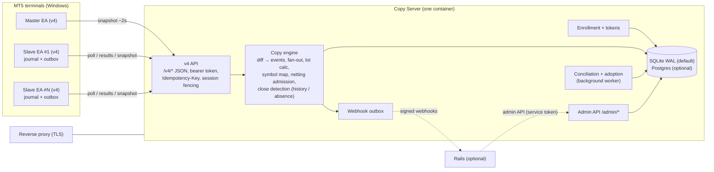

# 0001: Rails-agnostic copy core (standalone Copy Server)

- **Status:** Phase 0 — Approved (2026-10-05). Revision 4 (after scout verification of revision 3), Phase 0 of #77
- **Decision log:** 2026-10-05 — approved by the owner without further review rounds; residual risks are covered by the Phase 1 scenario gate (section 8).
- **Related:** #77 (this design), #78 (rename), #79 (conciliation by ticket, fixed by PR #81), #64 (shared API core), #66 (latency/slippage)
- **Reviewers:** the mt5 reviewers. Each numbered **Decision (Dn)** below can be approved or rejected on its own.

Rails citations describing legacy behavior are `path:line` against `master` at `4e64c5e` (before PR #82); EA citations against `python-signal` `main` at `2e7b827` (`EA/` = `MQL/Imentore/MT5/`, `Lib` = `EA/Lib/ImentoreLib-13.mqh`, `Slave` = `EA/ImentoreSlave-3.00-04.mq5`). This branch is rebased on `master` at `6548d58` (PRs #81 and #82 merged).

---

## 0. Changes since scout verification

The scout verified revision 3 and listed nine open contracts (C1–C9). All are resolved in this revision, together with the owner decisions of 2026-10-05 on correlation/netting exclusivity (5.8a) and the open questions Q1, Q9–Q11 (11).

| Contract | Resolution | Where |
|---|---|---|
| C1 exit deal ≠ full close | Precedence: same side + lower volume → partial; side changed → one reversal (one new generation); full exit confirmed → fast close. Deals deduplicated per `(account, deal)` in `processed_deals`, bound to the generation they affected; replays never act on a newer generation. T floor fixed at 60 s (30 s minimum removed; lower values rejected at config) | 5.4, 5.6 |
| C2 journal per action and attempt | `command_id` = logical obligation, `attempt_id` = one durable attempt; new attempt only after a definitive reject with no effect. Per-action evidence for `done`/`failed`; `DONE_PARTIAL` updates the residual and keeps the copy `closing`. `in_progress` is a receipt ack with a lease and redelivery | 4.5, 4.6, 5.5 |
| C3 absence of evidence ≠ not executed | `not_executed` only from `prepared` without proven send, or a definitive rejection. `sent` without conclusive evidence stays `uncertain`/`suspended` **per copy**, never global. Explicit operator/evidence resolution path. Order/request/deal ids persisted as soon as known | 4.6, 5.8 |
| C4 epoch and fencing | Server-issued `session_id` + `epoch`; retired sessions registry; timers epoch-aware (absence/mass counters restart after a server restart with a healthy confirmation, elapsed never reused across epochs); `ea_clock_offset_ms` on the wire; a fenced producer cannot re-authorize by inventing a new UUID | 4.3, 5.6 |
| C5 blocked_by and single successor | Unblock on **proof of zero exposure** (`closed`/`cancelled`/`skipped`/`error` proven). One successor per slot chosen atomically; stale candidates cancelled; policy/volume/specs/drain revalidated inside the transaction. Reversal reuses lifecycle close/cancel transitions (no close without identity). Fixed the lifecycle line that emitted `open` for `pending_blocked`/`skipped` | 5.3, 5.4, 5.5 |
| C6 drain and existing opens | Drain/suspend/link disable: proven-unsent opens superseded, in-flight opens cancelled/closed, known/uncertain exposure still managed; promotion revalidates account/link/mode; execution params frozen per copy/command | 5.3, 6.2 |
| C7 successive partials | Persisted `reduction_target`/residual; at most one financial mutation in flight per position; reductions coalesced; reduction during an in-flight open defined; hedging closes by resolved ticket, netting reduces with an opposite deal capped at confirmed volume, never flipping side | 5.4 |
| C8 adoption, external exposure, siblings | Unexpected exposure → explicit `symbol_conflicts` flow that blocks new opens on that symbol and reconciles; `superseded` sibling keeps exposure and close obligation until confirmed; netting physical-slot check before open; weak matching diagnostic only | 5.2, 5.8, 5.8a |
| C9 scheduling | Absolute per-callback cap (one HTTP call, ≤ 5 s); local close handling first; bounded results batch; fairness so poll/snapshots get turns; modify seq gaps accepted as non-contiguous (superseded seqs are skipped by tombstone) | 4.2, 4.5 |

<details>
<summary>Changes since review mt5-4 (collapsed)</summary>


Owner decisions of 2026-10-05 (OD1–OD8) are applied. Summary: Phase 1 copies **market positions only**; hedging-master → netting-slave links are rejected; netting conflicts never roll back a snapshot; disabled accounts **drain**; netting reversal is close-then-open; hedging partial closes are mirrored; lots below minimum are skipped by default and adjusted by contract size; a per-link entry-distance guard exists; close detection has a fast path (history exit deal) and a guarded absence path. The EA gets a durable command journal and result outbox, and the server an adoption rule, so a lost result can never duplicate or orphan a position.

| Finding | Resolution | Where |
|---|---|---|
| rev-1 #1, rev-2 B1 (lost result → duplicate/orphan; cursor ambiguity) | EA durable journal (`prepared/sent/uncertain/confirmed`) written before `OrderSend`; results outbox until 2xx; pre-open check by comment+magic; confirmed command re-delivered → result re-sent, never the order; ambiguous → command suspended + alert. Server adoption rule. Cursor is a hint; un-acked commands always re-included; per-copy issue order | 4.5, 4.6, 5.8 |
| rev-1 #2 (cancel race orphans a position) | `cancelled` only with proof the open never executed; delivered open → `cancel_requested`; EA closes an already-executed open and reports `closed`; late `open done` on cancel_requested → closing + close | 4.4, 5.5, 5.8 |
| rev-1 #3, rev-2 B2 (close/cancel expire; error frees netting symbol) | Copy financial state separated from command status. Only `open` (and superseded `modify`) expire; `close`/`cancel` never expire, retry with backoff; `error` on close only for confirmed not-found (→ `closed` with history). Netting reservation covers `pending_blocked/pending/open/closing/uncertain`; never freed on unconfirmed error. Pruning skips active obligations | 5.1, 5.2, 5.5, 5.9 |
| rev-1 #4, rev-2 I4 (seq after restart) | `session_id` per `OnInit` + seq; newer session with newer corrected `taken_at` restarts ordering; old-session requests fenced (409 `stale_session`); server monotonic clock for T; 3× `accepted:false` → new session + alert | 4.3, 5.6 |
| rev-1 #5, rev-2 B3 (netting runtime conflict) | OD1: hedging-master → netting-slave rejected (422), revalidated on enroll (link disabled + event). Close-then-reopen: new copy `pending_blocked` with `blocked_by`. Runtime conflicts → per-copy `skipped` + `copy.skipped_netting_conflict`, never rollback. Map/filter changes revalidated | 5.3 |
| rev-1 #6, rev-2 I6 (pending orders) | OD2: deferred to Phase 2. `copy_pending` rejected at config; `pending[]` may be reported, ignored for fan-out | 5.3a |
| rev-1 #7, rev-2 I5 (retry budget, 429/503, blocking) | One shared budget for all transient errors (attempts + total deadline); max one attempt per call per tick; retries scheduled between ticks via outbox; `Retry-After` per route; 404 defined; per-tick priority | 4.2 |
| rev-1 #8, rev-2 I3 (enroll/rotate response loss; token in cache) | Two-step rotation + `/v4/token/confirm`; replay → `409 rotation_pending`; enroll code consumed on first authenticated use (or reusable until TTL by same identity); token-bearing responses never stored in `idempotency_keys`, logs or raw | D8, 5.7 |
| rev-1 #9, rev-2 I2 (disable stops close) | OD3: drain mode; 403 only with no open copies or revocation; revocation vs suspension vs version gate distinguished; `master.stale` alert only | 6.2 |
| rev-1 #10, rev-2 I1 (netting reversal) | OD4: close then open on the new side, serialized via `generation` | 5.4 |
| rev-1 #11 (two global maps) | Two partial unique indexes | 5.1, 7.1 |
| rev-1 #12 (error storm storage) | First error per normalized signature + counter/last_seen/bounded samples; daily byte quota for raw/logs; never deletes transactional state | 5.9 |
| rev-1 #13, rev-2 S1 (#79 reference, rebase) | Branch rebased; #79 described as fixed on master by PR #81; BUY price and `eval` fixed by PR #82 | 6.1, 7.2 |
| rev-2 B4 (false mass close by absence) | OD8: fast path by history exit deal; absence path T ≥ 60 s and K snapshots, never while `connected=false`, mass-disappearance guard; snapshot carries `connected/login/server`; 409 on account mismatch; EA waits for connection + history sync | 4.3, 5.6 |
| rev-2 I7 (slave-side closes) | Slave snapshot + slave history exit deal → `closed` with `close_reason`; close result `position_not_found` + history → closed | 5.5 |
| rev-2 I8 (hedging partial close) | OD5: `close_partial` mirrored; netting volume rule stated | 5.4 |
| rev-2 I9 (contract size, below-min default) | OD6: skip default (opt-in `open at volume_min`); contract-size factor; map rejected when sizes differ without opt-in | 5.4 |
| rev-2 I10 (guard vs master price) | OD7: `master_price` + `max_entry_deviation_points`; `failed: price_out_of_range` | 4.4 |
| rev-2 S1 (specs, cycles, modify, Appendix A) | `symbol_specs` adds `filling_modes, stops_level, freeze_level, tick_size`; copy cycles rejected; `exclude_copier_positions`; modify supersession; `api_time_max_seconds` | 5.1, 5.3, 5.5, App. A |

</details>

<details>
<summary>Changes since review mt5-3 (collapsed)</summary>

Owner decisions of 2026-10-04: python-signal is not imported; no EA is installed; v3 wire compatibility dropped; new v4 protocol and new EA; netting one copy per symbol in Phase 1; server-side lots from EA-reported specs; market orders at market on both sides. Main mappings: explicit `close` commands (rev-1 #1, rev-2 A2); lot rounding (rev-1 #2, rev-2 A3); identity model (rev-1 #3); `copy_groups` (rev-1 #4); token always required (rev-1 #5, rev-2 A10); per-token rate limits (rev-1 #6); server-only symbol mapping (rev-1 #7, rev-2 A11); `BEGIN IMMEDIATE` + transaction retry (rev-1 #8, rev-2 A7); idempotency keys + transition idempotency (rev-1 #9); behavior scenarios instead of a golden recorder (rev-1 #10/#11, rev-2 A14); CI path filters (rev-1 #12); legacy facts in Appendix A (rev-1 #13, rev-2 A1/A15); raw storage sampling (rev-2 A8); absence close (rev-2 A9, now refined); OPENED after close (rev-2 A12); log cap (rev-2 A13); python-signal archived, no MT4 (rev-2 A16); per-terminal token file (rev-2 A17).

</details>

---

## 1. Context, goals, non-goals

### 1.1 What exists today

Copy trading runs entirely inside the Rails app:

- The master EA (`EA/ImentoreCopy-3.00-04.mq5`) uploads a JSON snapshot of positions, pending orders and the last 30 history deals every ~2 s to `POST /api/v3/copy/post/orders/...` (`app/controllers/api/v3/api_copy.rb:15`).
- Rails stores the raw body as `Message::V3::MetaCopy`, `API::V3::CopyPresenter` diffs it against `Transaction`s, and `Model::TraceService#create_order` fans out one `TransactionSlave` per enabled slave in each trace (`app/services/model/trace_service.rb:23-83`).
- Each slave EA polls `slave/post/orders` (`api_slave.rb:33-45`), receives pipe-delimited rows, executes locally, and reports each result to `slave/post/update` with a `metaState` (`api_slave.rb:12-29`; state machine in `slave_presenter.rb:19-83`).

All of it is entangled with `Store`, `Customer`, `Trace`, `Permission`, `CustomerPlan` and billing. Copying between two of your own accounts needs Rails + Postgres + Redis + seeds.

### 1.2 Goals

1. **Individuals first:** one small container that copies one master to N slaves the user owns. No customers, plans or billing.
2. **A clean v4 protocol and a new EA written in this repo**, authenticated, idempotent, JSON, with bounded non-blocking retries and a durable execution journal.
3. **Preserve the business rules** v3 encodes (fan-out, netting/hedging, magic restrictions, instrument rename, metaState handling, close races, conciliation), proven by scenario tests.
4. Multi-customer business stays possible through Rails as an optional client (Phase 3).
5. Fix known weaknesses: shared secrets in EAs, unauthenticated endpoints, no TLS, in-memory sessions, JSON-file storage.

### 1.3 Non-goals

- v3 wire compatibility. MT4, cTrader, other platforms. Signal marketplace, Telegram, billing (stay in Rails).
- Moving execution out of the terminal. The server coordinates; the EA executes.
- **Phase 1:** pending (limit/stop) orders, netting multi-copy sharing, proportional netting partials (Phase 2).

---

## 2. Repository layout

### D1. Layout

```
mt5-web-replicator/ (renamed per #78)
├── ea/mt5/             # NEW MQL5 EA (master + slave v4 client, Lib); written fresh
├── server/             # NEW Copy Server (FastAPI, Python 3.12): app/ tests/ pyproject.toml Dockerfile
├── web/                # this Rails app, moved as-is
├── installer/          # Windows installer (later, Q10)
├── docs/               # design docs; docs/protocol/v4 (OpenAPI + scenario fixtures)
├── docker-compose.yml  # server by default; `--profile web` adds Rails+Postgres+Redis
└── .github/workflows/
```

**Recommendation:** adopt. `web/` is moved with one plain `git mv` commit (no `filter-repo`, so PR/issue SHAs stay valid; per-file history via `git log --follow`). Fallback: keep Rails at root and add `server/` + `ea/` beside it.

### D2. python-signal becomes legacy (no history import)

python-signal is archived read-only with a README pointer to this repo. Legacy EAs (3.x, 2.x, MT4) and the Python client stay there. The new EA borrows only ideas (MFE/MAE, slippage guard), citing the source file when it does.

### D3. CI per directory

| Workflow | Trigger paths | Jobs |
|---|---|---|
| `web.yml` | `web/**` | RSpec, rubocop (`working-directory: web`) |
| `server.yml` | `server/**`, `docs/protocol/**`, `ea/mt5/**` (v4 client structs), `web/app/controllers/api/**`, `web/app/presenters/API/**`, `web/spec/api/**`, the workflow file | ruff, mypy, pytest incl. scenarios and OpenAPI schema check |
| `ea.yml` | `ea/**`, `docs/protocol/**` | lint; EA v4 struct names vs OpenAPI (generated header). MQL compile needs MetaEditor, out of scope |
| `docker-publish.yml` | tags + main | `-server` and `-web` images |
| `cla.yml` | PRs | one CLA bot |

Fixtures are never regenerated automatically in CI; changing an expected outcome is a reviewed diff.

### D4. Sequencing relative to the rename (#78)

1. Keep the repo name for now (Q1); new EA/server names decided in Phase 1 (#78).
2. Move Rails to `web/`, split CI. One "moves only" PR with a deploy dry-run.
3. Add `server/` and `ea/mt5/` in feature PRs.
4. Archive python-signal with the pointer README.

---

## 3. Copy Server architecture

### 3.1 Components



- **Copy engine:** pure Python, no framework imports. Input: a snapshot or a slave report. Output: state changes and commands.
- **Conciliation + adoption:** background job over slave snapshots/history, batched, outside request transactions (D6). Adoption (5.8) also runs inline on `slave/snapshot` for copies in `uncertain`.
- **Webhook outbox:** events written in the same transaction as the state change, delivered asynchronously.

### D5. Python 3.12 + FastAPI

FastAPI + Pydantic v2 + SQLAlchemy 2 (sync) + Alembic, uvicorn. The owner already runs a FastAPI license server, the repo stays Ruby + Python + MQL, and Pydantic generates the v4 OpenAPI document used by the EA struct check. Load is small.

### D6. Persistence: SQLite by default, Postgres optional

SQLite WAL at `/data/copy.db`; `DATABASE_URL=postgresql://...` switches to Postgres. CI runs the suite on both.

- pysqlite in autocommit; a SQLAlchemy `begin` event issues **`BEGIN IMMEDIATE`** so the write lock is taken before the diff read.
- `busy_timeout=5000`, WAL, `synchronous=FULL` (a power loss must not drop a committed result; the volume is small), `foreign_keys=ON`, `auto_vacuum=INCREMENTAL`.
- On `SQLITE_BUSY`: retry the whole unit of work (max 3, jittered), then `503` + `Retry-After`.
- No external I/O inside a transaction. Conciliation, adoption sweeps and pruning run in one background thread, ≤ 200 rows per transaction.
- One uvicorn worker on SQLite (enforced at startup); Postgres uses row locks (`SELECT ... FOR UPDATE` on the account row) with the same retry.
- **Business conflicts are never exceptions inside the unit of work.** Netting admission, lot skips, filter rejections are resolved per copy (state + event) so one bad position never rolls back the snapshot (5.3).

### D7. Deployment and configuration

One image (python:3.12-slim, non-root, `HEALTHCHECK /healthz`), compose service + volume, TLS at the proxy. Env-only config (all overridable per account/link in the admin API where noted):

| Var | Default | Notes |
|---|---|---|
| `DATABASE_URL` | `sqlite:////data/copy.db` | |
| `ADMIN_TOKEN`, `TOKEN_PEPPER` | *(required)* | refuse to start if unset outside `ENV=dev` |
| `CLOSE_ABSENT_SNAPSHOTS`, `CLOSE_ABSENT_SECONDS` | `3`, `60` | absence path (5.6); `CLOSE_ABSENT_SECONDS < 60` refused at startup/config |
| `MASS_DISAPPEAR_MIN`, `MASS_DISAPPEAR_SECONDS` | `3`, `300` | mass-disappearance guard (5.6) |
| `OPEN_TTL_SECONDS` | `30` | `api_time_max_seconds` equivalent (4.4) |
| `MASTER_STALE_SECONDS` | `120` | `master.stale` alert (6.2) |
| `RAW_SNAPSHOT_RETENTION_H`, `EVENT_RETENTION_D`, `LOG_RETENTION_D` | `48`, `30`, `7` | 5.9 |
| `RAW_DAILY_QUOTA_MB`, `LOG_DAILY_QUOTA_MB` | `50`, `20` | 5.9 |
| `WEBHOOK_URL`, `WEBHOOK_SECRET` | unset | Rails, optional |

---

## 4. Protocol v4

### 4.1 Principles

- HTTPS, JSON both ways, UTF-8. Schema = Pydantic models, published as `docs/protocol/v4/openapi.json`.
- **`Authorization: Bearer <account token>`** on every call except `/v4/enroll`. The token determines account and role.
- **`Idempotency-Key`** (UUID per logical operation, reused on retry) on every mutating call; stored 24 h per account with the response; replay returns the stored response; same key + different body → `409`. **Exception:** responses that contain a token (enroll, rotate) are never stored (D8).
- Status codes: `200/201/204` success; `400` malformed; `401` bad/missing/revoked token; `403` account blocked with no open copies (6.2); `404` unknown resource; `409` conflict (key reuse, `stale_session`, `account_mismatch`, `rotation_pending`); `413` too large; `422` validation; `429` (with `Retry-After`); `5xx`/`503`.
- Every response carries `server_time` (UTC ms) so the EA keeps a clock offset.

### 4.2 EA HTTP client, retry and scheduling (rev-1 #7, rev-2 I5)

The legacy `ApiData` (`Lib:210-292`) loops `while (status != 201)` forever. `WebRequest` is synchronous, so the v4 EA never retries inside a call:

- **At most one HTTP attempt per request per timer tick** (timer 1 s). No `Sleep` loops. A failed request goes to a per-route **outbox** with `next_attempt_at`.
- **One transient budget** for 429, 503, other 5xx, timeout and network errors: max 6 attempts **and** 60 s total deadline per request, backoff 1/2/4/8/16 s with jitter. `Retry-After` sets `next_attempt_at` **for that route only**; other routes continue.
- **When the budget runs out:** state requests (`master/snapshot`, `slave/snapshot`, `config`, `commands` poll) are dropped and replaced by fresh state on a later tick. **Event requests (`slave/results`) are never dropped**: they stay in the durable outbox (4.6) and keep retrying at the max backoff (16 s) indefinitely, with a chart alert after the budget.
- Request timeout 5 s passed to `WebRequest`.
- **Per-callback cap (C9):** each `OnTimer` callback makes **at most one HTTP call** (so ≤ 5 s blocked), whatever is due. Local work runs first and never waits on HTTP: execution of already-received `close`/`close_partial`/`cancel` commands and journal recovery, then already-received `open`/`modify`.
- **Fairness:** the single HTTP slot rotates among due routes: results batch, commands poll, snapshot, then config/symbols/logs. Results get every other slot at most while a backlog exists, so poll and snapshots always get turns; `next_attempt_at` of each route is respected. A results batch carries at most 50 results (bounded body).

| Response | EA behavior |
|---|---|
| 2xx | success; remove from outbox |
| 400 / 413 / 422 | no retry for state requests (log + alert). For `slave/results`: keep in outbox, alert (a server/EA bug), retry every 5 min |
| 404 | unknown route/resource: no retry; alert "server version mismatch". On `results` for an unknown `command_id`: the server answers 200 `{unknown:[ids]}` instead (never 404), the EA drops those after logging |
| 409 `stale_session` | start a new session (5.6) |
| 409 `account_mismatch` | stop sending snapshots, alert "terminal logged into a different account" |
| 409 other | no retry; log |
| 401 | stop all calls except `/v4/enroll`; show "re-enroll" |
| 403 | stop opening; keep polling `/v4/config` every 5 min (6.2) |
| 429 / 503 / 5xx / timeout / network | transient budget above |

**Per-tick order:** (1) local: close/close_partial/cancel execution and journal recovery, (2) local: open/modify execution, (3) the one HTTP call chosen by the fair rotation above. Execution of `close` commands already received never waits on HTTP.

### 4.3 Endpoints

| Route | Caller | Request → Response |
|---|---|---|
| `POST /v4/session` | EA, each `OnInit` and after `409 stale_session` | `{boot_nonce, taken_at, ea_clock_offset_ms}` → `201 {session_id, epoch}` (server-issued; retires the previous session) |
| `POST /v4/enroll` (no token) | EA, once | `{code, broker_server, login, role, margin_mode, ea_version}` → `201 {token, account_id}` (never cached) |
| `POST /v4/token/rotate` | EA | → `200 {new_token, pending_id}`; old token stays valid; replay while pending → `409 rotation_pending` |
| `POST /v4/token/confirm` | EA, with the **new** token | `{pending_id}` → `204`; revokes the old token |
| `GET /v4/config` | both, on init + every 60 s | → `200 {mode: normal|drain, message, poll_ms, debug, send_history, symbols_wanted[], min_ea_version}` |
| `PUT /v4/symbols` | both on init + daily | `{symbols:[{name, volume_min, volume_step, volume_max, contract_size, digits, point, tick_size, trade_mode, filling_modes, stops_level, freeze_level}]}` → `204` |
| `POST /v4/master/snapshot` | master, ~2 s and on trade events | see below → `200 {accepted, seq}` |
| `GET /v4/slave/commands?after=<cursor>` | slave, ~2 s | → `200 {commands[], cursor}` (4.5) |
| `POST /v4/slave/results` | slave outbox | `{results:[{command_id, copy_id, status, order, deal, position_ticket, position_id, symbol, volume, price, sl, tp, executed_at, error_code, message}]}` → `200 {unknown:[]}` |
| `POST /v4/slave/snapshot` | slave, ~10 s and after any execution | same shape as master snapshot (positions + recent history) |
| `POST /v4/logs` | EA when `debug=true` | text, ≤ 256 KB → `204`; `413` above cap or daily quota (EA stops until next config) |

**Snapshot body** (master and slave): `{session_id, epoch, seq, taken_at, ea_clock_offset_ms, connected, login, server, history_synced, positions[], pending[], history[]}`. `ea_clock_offset_ms` is the EA's current estimate of `server_time − local time` (0 until the first response).

- `positions[]`: `position_ticket, position_id (POSITION_IDENTIFIER), symbol, type, volume, price_open, sl, tp, magic, comment, time_msc`.
- `history[]`: `deal, order, position_id, entry (in|out|inout|out_by), reason, symbol, volume, price, profit, commission, swap, magic, comment, time_msc`. Window: deals since the last accepted snapshot, at least the last 30.
- `pending[]`: may be reported; **ignored for fan-out in Phase 1** (5.3a).
- `connected` = `TERMINAL_CONNECTED`; `login`/`server` = `ACCOUNT_LOGIN`/`ACCOUNT_SERVER`. The server answers **`409 account_mismatch`** when they differ from the token's account (normalized server name) and stores nothing. The EA sends no snapshot until `TERMINAL_CONNECTED` is true, `ACCOUNT_LOGIN` matches its token file, and `HistorySelect` for the window has returned (`history_synced=true`).

### 4.4 Slave commands

```json
{"command_id": "c_01J...", "action": "open|modify|close|close_partial|cancel",
 "copy_id": 812, "seq_in_copy": 1, "symbol": "GOLD", "side": "buy|sell",
 "volume": 0.20, "master_price": 2345.10, "sl": 2310.5, "tp": 2380.0,
 "max_slippage_points": 30, "max_entry_deviation_points": 150,
 "position_id": null, "magic": 4242, "comment": "c812",
 "issued_at": 1759561234567, "expires_at": 1759561264567}
```

- **Phase 1 sides are `buy`/`sell` only** (market). Execution at current market with `deviation = max_slippage_points` and a filling mode taken from the symbol's `filling_modes`.
- **Entry-distance guard (OD7):** before `OrderSend` the EA checks `|current_price − master_price| / point ≤ max_entry_deviation_points` (ask for buy, bid for sell); otherwise it reports `failed: price_out_of_range` and nothing is sent. `max_entry_deviation_points` is per link (null = off). `deviation` still bounds slippage relative to the price at send time.
- **Expiry:** only `open` carries `expires_at` (`OPEN_TTL_SECONDS`, equivalent of legacy `api_time_max_seconds`); the EA refuses an `open` past expiry (`status: expired`). `modify` has no TTL but is superseded (5.5). **`close`, `close_partial` and `cancel` never expire.**
- `close`/`close_partial`/`modify` carry `position_id`; the EA resolves the current position ticket from it (tickets may change).
- `cancel` targets an `open` command the server no longer wants. The EA answers: `not_executed` (journal shows never sent; the open command is then dropped locally), or, if the open was executed, it **closes that position** and reports `closed` with the close deal.
- `comment` = `c<copy_id>` (≤ 31 chars), with link `magic`. **The comment `c<copy_id>` is the correlation key** for the journal check (4.6) and adoption (5.8). It does not depend on the symbol name, so it works across different broker symbol names (e.g. master `EURUSD`, slave `EURUSD.m`).
- **Netting physical-slot check (owner decision 2026-10-05):** before sending an `open` on a netting slave, the EA verifies there is no position on that symbol that is not managed by the copier (no position, or only the one this copy owns). Otherwise it sends nothing and reports `failed: unmanaged_position_on_symbol` (copy `error`, event `copy.slot_occupied`, chart alert).
- Execution parameters (symbol, side, volume, magic, comment, deviation, guard) are **frozen in the command payload** at issue time; later config changes (magic, maps, multiplier) apply only to new copies and never change how existing copies are recognized (C6).

### 4.5 Delivery semantics and cursor (rev-1 #1, rev-2 B1.4)

- Commands are durable rows. A poll returns **every command for this slave whose state is not terminal** (`queued`, `delivered`, `retry_wait` past its time), plus new ones; `after=<cursor>` only lets the server skip re-serializing commands the EA has *acked*; it never hides an un-acked command.
- A command is acked by a result for its `command_id` (any terminal status) or by a `status: in_progress` result the EA posts when it moves the journal entry to `sent`. **`in_progress` is a receipt ack, not a settlement (C2):** it puts the command under a lease (`lease_until = now + 120 s`, renewed by any later `in_progress`/snapshot from that session). On lease expiry, or on a new session, the command is re-delivered; the EA answers from its journal (4.6) and never re-executes a sent attempt.
- **Per-copy ordering:** commands carry `seq_in_copy`. The EA executes a copy's commands in that order; if an `open` failed/expired, later `modify`/`close` of that copy are reported `skipped: open_not_executed`. Different copies are independent.
- **Seq gaps (C9):** `seq_in_copy` is monotonic but **not contiguous**. A superseded modify is delivered once as a tombstone `{command_id, action:"superseded"}` if it was ever delivered; otherwise it simply never appears. The EA executes the lowest pending seq it holds and never waits for a missing number.

### 4.6 EA durable journal and results outbox (rev-1 #1, rev-2 B1)

Files in the terminal's own `MQL5\Files`, per account and role: `journal_<server>_<login>.jsonl` (append-only, compacted on start) and `outbox_<server>_<login>.jsonl`. Writes use `FileFlush`; compaction writes a temp file then `FileMove` with `FILE_REWRITE`.

```
journal entry: (command_id, attempt_id) → {copy_id, action, state: prepared|sent|uncertain|confirmed|suspended,
                 request, order, request_id, deal, position_id, executed_volume, residual_volume, result}
```

`command_id` is the **logical obligation** (open this copy, close that position); `attempt_id` is **one durable attempt** to fulfil it. The server issues a new `attempt_id` for the same `command_id` only after a definitive reject with no effect (e.g. `MARKET_CLOSED`, `REQUOTE`) on retry; the journal deduplicates by `(command_id, attempt_id)` (C2).

1. On receiving a command attempt: if the journal has it `confirmed`, **re-enqueue the stored result**; never execute that attempt again. A **new** `attempt_id` of a command whose previous attempt is `confirmed failed` (definitive, no effect) is executed normally (e.g. close after `MARKET_CLOSED` once the market reopens). If the copy has any attempt `sent`/`uncertain`/`suspended`, no new attempt executes for **that copy** until it is resolved; other copies continue.
2. **Pre-send evidence check, per action:**
   - `open`: scan positions, orders and `HistorySelect` deals for `comment == c<copy_id>` + link magic. Found → `confirmed done` with the real ids; nothing sent.
   - `close`: position for `position_id` absent **and** an exit deal for it in history → `confirmed done`. Position present → execute.
   - `close_partial`: compare the position's current volume with the persisted `residual_volume` target; already at or below target → `done` with the observed volume.
   - `cancel`: journal shows the open never reached `sent` → `not_executed`; open in flight → wait for it; position exists → close it and report `closed`.
3. Write `prepared`, flush; write `sent`, flush; call `OrderSend` / `PositionClose`. Persist `order`/`request_id`/`deal` in the journal **as soon as each is known** (from `MqlTradeResult` and `OnTradeTransaction`).
4. **Per-action evidence for `done`:** open → entry deal + `position_id`; close → position gone and exit deal(s) attributable to `position_id`; close_partial → executed volume and resulting position volume. `DONE_PARTIAL` reports `executed_volume` and `residual_volume`: the server updates the copy volume and keeps it `closing` (close) or keeps the reduction target (partial) while exposure remains, issuing the remaining volume as a new attempt.
5. On a definite reject (`REQUOTE`, `PRICE_OFF`, `INVALID_*`, `NO_MONEY`, `MARKET_CLOSED`, etc.) with no deal → `confirmed failed` + `error_code` for this attempt only. The obligation (command) is still open on the server for close/close_partial/cancel.
6. On timeout / no answer / restart while `sent`: mark `uncertain` and re-run the step-2 check with the persisted ids (order/deal lookup first, then comment). Conclusive evidence of execution → `confirmed done`. **No evidence never proves non-execution (C3):** a `sent` attempt without conclusive evidence stays `uncertain`; after the checks the entry becomes `suspended` + chart alert + result `status: uncertain`. `failed: not_executed` is only reported from `prepared` (never sent) or from a definitive rejection.
7. **Suspension is per copy**, never global. A suspended entry is resolved only by (a) broker evidence found later (EA re-check on every snapshot tick, or server adoption 5.8), or (b) an explicit operator action in admin (`resolve: executed{position_id}` / `not_executed`, audited). The resolution updates the journal (via a `resolve` command) and unblocks the copy's pending close/cancel. A suspended open whose master closed keeps a durable close obligation on the server (copy `uncertain` with `close_intent=true`).
8. The outbox is retried until 2xx (4.2). On restart, every `sent`/`uncertain` entry is re-checked (step 6) before any new attempt of the same copy executes.

Exactly-once execution is not claimed: the window between broker acceptance and the `sent` flush is closed by the comment/magic scan, not by the file alone.

### 4.7 Sequence

```mermaid
sequenceDiagram
    autonumber
    participant M as Master EA
    participant S as Copy Server
    participant DB as DB
    participant SL as Slave EA
    participant J as Slave journal/outbox (MQL5\Files)

    M->>S: enroll / SL->>S: enroll (code) → token (not cached)
    SL->>S: PUT /v4/symbols (specs)
    M->>S: snapshot {session, seq, connected:true, login, positions:[P1]}
    S->>DB: BEGIN IMMEDIATE; diff; admission; copies + command(open); outbox; COMMIT
    S-->>M: 200 {accepted}

    SL->>S: GET /v4/slave/commands
    S-->>SL: [open c812 GOLD buy 0.20, master_price]
    SL->>J: check journal + comment c812 scan (none)
    SL->>J: prepared → sent (flush)
    SL->>SL: price guard; OrderSend
    SL->>J: confirmed {deal, position_id}; result → outbox
    SL--xS: POST results (timeout)
    Note over SL,J: next tick: outbox retry (1 attempt/tick)
    SL->>S: POST results {done, position_id}
    S->>DB: copy → open

    alt fast close (history)
        M->>S: snapshot without P1, history has exit deal of P1
        S->>DB: master_position closed; copy → closing; command(close)
    else absence only
        M->>S: snapshots without P1, connected:true (K ≥ 3 and T ≥ 60 s server clock)
        Note over S: mass guard: if ≥ N / all vanish → longer T, send_history, alert
        S->>DB: master_position closed; copy → closing; command(close)
    end

    Note over S: slave disabled meanwhile → config.mode=drain (close still delivered)
    SL->>S: GET commands → [close c812]
    SL->>SL: PositionClose (journal sent → confirmed)
    SL->>S: POST results {done, deal, profit}
    S->>DB: copy → closed

    Note over SL,S: adoption: if a result was lost and the open expired,<br/>slave snapshot shows comment c812 + magic → copy adopted<br/>→ open (master open) or closing + close (master closed)
```

---

## 5. Core model and rules

### 5.1 Tables

```
accounts         id, broker_server, broker_server_norm, login, role(master|slave), margin_mode(hedging|netting|unknown),
                 label, status(active|suspended|revoked), suspended_reason, ea_version, last_seen_at,
                 session_id, session_epoch, session_taken_at, last_seq, exclude_copier_positions,
                 token_hash, pending_token_hash, pending_token_id, token_issued_at,
                 UNIQUE(broker_server_norm, login, role)
enroll_codes     id, account_id, server_norm, login, role, code_hash, expires_at, consumed_at
symbol_specs     account_id, symbol, volume_min, volume_step, volume_max, contract_size, digits, point, tick_size,
                 trade_mode, filling_modes, stops_level, freeze_level, updated_at, PK(account_id, symbol)
copy_groups      id, master_id, name, enabled, magic_allow(json), symbol_filter(json)          -- ≈ Rails Trace
copy_links       id, group_id, master_id, slave_id, enabled, disabled_reason,
                 lot_mode(master|multiplier|fixed|min_lot_x), lot_value, below_min(skip|open_min),
                 allow_contract_size_diff, magic_mode(same|fixed), magic_value,
                 max_slippage_points, max_entry_deviation_points, copy_sl_tp,
                 UNIQUE(group_id, master_id, slave_id)
symbol_maps      id, slave_id (NULL = global), master_symbol, slave_symbol
                 UNIQUE(master_symbol) WHERE slave_id IS NULL
                 UNIQUE(slave_id, master_symbol) WHERE slave_id IS NOT NULL
master_positions id, master_id, position_id, generation, position_ticket, symbol, type, volume, price_open, sl, tp,
                 magic, comment, state(open|closed), absent_count, absent_since_mono, absent_epoch, mass_episode_id,
                 close_source(history|absence|reversal),
                 opened_at, closed_at, UNIQUE(master_id, position_id, generation)
copies           id, link_id, master_position_id, slave_id, slave_margin_mode, symbol_master, symbol_local, volume,
                 sl, tp, state (5.2), blocked_by, skip_reason, close_reason, no_sltp, close_intent,
                 confirmed_volume, reduction_target, exec_params(json, frozen at issue),
                 open_order, open_deal, position_ticket, position_id, close_deal, price_open, price_close,
                 profit, fee, notmodify_count, notmodify_day, latency_ms, slippage_points,
                 opened_at, closed_at, conciliated_at,
                 UNIQUE(link_id, master_position_id)
commands         id (command_id), copy_id, seq_in_copy, action, payload(json),
                 state(queued|delivered|in_progress|retry_wait|done|failed|expired|superseded|skipped),
                 attempt_id, attempts, next_attempt_at, lease_until, issued_at, expires_at, acked_at, result(json)
command_attempts command_id, attempt_id, issued_at, outcome(done|done_partial|rejected|uncertain), evidence(json)
sessions         id (server-issued), account_id, epoch, boot_nonce, created_at, retired_at
processed_deals  account_id, deal, position_id, generation, effect(partial|reversal|close|none), PK(account_id, deal)
symbol_conflicts id, slave_id, symbol_local, kind(unexpected_exposure|unmanaged_position|late_adoption),
                 copy_id, position_id, opened_at, resolved_at, resolution
idempotency_keys account_id, key, request_sha256, response(json, never token-bearing), created_at, PK(account_id, key)
inbound_raw      id, account_id, kind, content(gz), content_sha256, received_at, reason(change|heartbeat|error)
error_signatures account_id, signature, first_raw_id, count, first_seen, last_seen, samples(≤5 raw ids)
events (outbox)  id, type, payload(json), created_at, delivered_at, attempts
api_tokens       id, name, token_hash, scopes, created_at, revoked_at
```

`master_positions.closed` is the only terminal master state; `closing` disappears from the master because the master's close is a fact, not a request. `copy_groups` keeps the Rails trace dimension: two traces linking the same accounts become two groups and two links (Q4, approved).

### 5.2 Copy state vs command status (rev-1 #3, rev-2 B2)

The copy's state describes **exposure on the slave**; commands describe **attempts**. A command failing never by itself ends a copy whose position may be alive.

| Copy state | Meaning | Exposure possible? | Netting reservation |
|---|---|---|---|
| `pending_blocked` | waiting for `blocked_by` copy to prove zero exposure | no | no (the blocking copy holds the slot) |
| `pending` | open command queued/delivered | maybe (in flight) | yes |
| `open` | position confirmed | yes | yes |
| `cancel_requested` | master closed before open confirmed; cancel issued | maybe | yes |
| `closing` | close command outstanding | yes | yes |
| `uncertain` | EA reported `uncertain`/suspended, or open expired after delivery; per copy only | maybe | yes |
| `closed` | position confirmed closed (result, master/slave history) | no | no |
| `cancelled` | proven never executed (`not_executed`, or open never delivered) | no | no |
| `skipped` | not opened by policy (netting conflict, below min, filter, price guard on first open) | no | no |
| `error` | open definitively failed with no position (e.g. `symbol_not_found`, `failed` reject) | no | no |
| `superseded` | duplicate sibling: marks the logical relation only. While its extra position is alive it keeps a close obligation (`close_intent`) and is managed like `closing`; it becomes terminal only when the close is confirmed | yes until close confirmed | yes until close confirmed |

- Netting index: `UNIQUE(slave_id, symbol_local) WHERE slave_margin_mode='netting' AND (state IN ('pending','open','cancel_requested','closing','uncertain') OR (state='superseded' AND close_intent))`. A `pending_blocked` copy is outside the index; promotion to `pending` (5.3) happens in the same transaction that proves the blocking copy has zero exposure. The symbol is freed only on `closed`/`cancelled`/`skipped`/`error`, all of which require proof of no exposure; `error` on a close never frees it (5.5). An open `symbol_conflicts` row also blocks new opens on that slave symbol (5.8).
- Hedging index: `UNIQUE(slave_id, position_id) WHERE position_id IS NOT NULL AND slave_margin_mode='hedging'`.
- Master: `UNIQUE(master_id, position_id, generation)`.

Identity (unchanged): order ticket (audit), deal ticket (fills, close confirmation), position ticket (handle, refreshed from snapshots, may change), `POSITION_IDENTIFIER` (stable key).

### 5.3 Netting and link validation in Phase 1 (OD1, rev-1 #5, rev-2 B3)

**Config time (`422 config_conflict`):**

- A link from a **hedging master to a netting slave is rejected**. A slave with `margin_mode=unknown` (not enrolled yet) can be linked; on enroll, when `margin_mode` becomes known, every link of that slave is revalidated: conflicting links are set `enabled=false, disabled_reason=…` and `link.disabled_conflict` is emitted. Same revalidation on master enroll.
- Several enabled links to one netting slave must have disjoint explicit `symbol_filter` allow-lists (after `symbol_maps`), or only one link exists. Revalidated on any change of maps, filters or links; a change that creates overlap is rejected.
- **Copy cycles** are rejected: a link whose master account (same broker server + login) is reachable from the slave through enabled links. Accounts that are both master and slave can also set `exclude_copier_positions` so the master snapshot ignores positions whose comment matches `c<id>` with a copier magic.
- `copy_pending=true` is not accepted (5.3a).

**Runtime admission (per copy, inside the snapshot unit of work, never raising):**

1. New master position for a netting slave, and the slot is held by a copy of an **earlier generation/position of the same master and link that is being closed or cancelled** (close-then-reopen): new copy `pending_blocked`, `blocked_by=<previous copy>`. No `open` is emitted.
   - **Unblock condition (C5):** the predecessor reaches a state with **proof of zero exposure**: `closed`, `cancelled`, `skipped`, or `error` proven without exposure. An inconclusive error, `uncertain` or `closing` never unblocks.
   - **Single successor (C5):** in the same transaction, the engine cancels every candidate blocked on that slot whose master position/generation is no longer open (`cancelled`, never sent, event), then chooses **one** eligible successor (the newest open generation of that slot); others stay blocked behind it or are cancelled if stale. Promotion revalidates, inside the transaction: account status (not drain/suspended), link enabled, `mode`, symbol filter/map, specs and lot policy (C6). If revalidation fails → that copy `skipped` with reason, no open. Otherwise: reserve the symbol, set `pending`, issue `open` with a fresh `expires_at` and frozen `exec_params`.
   - If the new master position closes while blocked → `cancelled` (never sent).
2. Any other conflict (should be impossible after config validation, e.g. a race with a config change, or an open `symbol_conflicts` row): copy `skipped`, `skip_reason=netting_conflict`, event `copy.skipped_netting_conflict`. Snapshot still `200`, other positions processed normally.

Netting **master** (allowed to netting or hedging slaves): one position per symbol. Volume changes in Phase 1 (stated rule, OD5): **reductions** are mirrored with `close_partial` using the reduction rules of 5.4 (netting execution path); **increases** are not mirrored and emit `copy.volume_drift` with master/slave volumes. Reversal: 5.4.

#### 5.3a Pending orders deferred (OD2, rev-1 #6, rev-2 I6)

Phase 1 copies market positions only. `copy_links.copy_pending` does not exist in Phase 1 (rejected with 422 if sent). Master `pending[]` may be reported and stored on change but is **ignored for fan-out**. A master pending order that fills appears as a new position (new `position_id`) and is copied as a market open like any other; its `master_price` is the fill price. Phase 2 adds `(master_id, order_ticket)` identity, `place/modify/cancel_order` commands and the order→position transition.

### 5.4 Lots, partials, reversal (OD4, OD5, OD6)

Server-side, from `symbol_specs` of master and slave:

```
raw = master      : master_volume
      multiplier  : master_volume × lot_value
      fixed       : lot_value
      min_lot_x   : slave.volume_min × lot_value
if mode ∈ {master, multiplier} and both contract sizes known:
      raw = raw × master.contract_size / slave.contract_size
lot = floor(raw / step) × step      (Decimal; then quantized to step's digits)
lot = min(lot, volume_max)
if lot < volume_min:  below_min = skip (default) → copy skipped, skip_reason=below_min, event copy.skipped_below_min
                      below_min = open_min (opt-in) → lot = volume_min
```

- **Contract size at config:** a `symbol_map` used by a link whose master and slave contract sizes differ is rejected (422) unless the link sets `allow_contract_size_diff=true` (then the factor above applies). If a spec is missing at fan-out: copy `skipped: missing_symbol_spec`, the symbol is added to `symbols_wanted`.
- Test table: min 0.01 and 0.1, step ≠ min, multiplier 0.333, clamp at max, contract 100 vs 10, raw below min with each policy.

**Master event precedence (C1).** For each master `position_id` in a snapshot, exactly one interpretation applies, in this order:

1. Position present, **same side, lower volume** → partial reduction (below), even if an `out` deal is in history.
2. Position present, **side changed** (or an unprocessed `inout` deal) → one reversal = one new generation (below).
3. Position absent **and** exit deal(s) confirm a full exit → fast close (5.6).
4. Position absent without exit deal → absence path (5.6).

Each history deal is recorded once in `processed_deals (account_id, deal)` with the generation it affected. A deal already processed is ignored on later snapshots (the history window repeats the last 30 deals), and a deal whose time precedes the current generation's start can never close or reverse that generation.

**Partial reductions (OD5, C7).** The target is proportional to the master, computed from persisted values, never from in-flight volumes:

```
reduction_target(copy) = round_down_step(copy.opened_volume × new_master_volume / master.opened_volume)
```

- `confirmed_volume` is the copy's volume confirmed by results/snapshots. The next `close_partial` volume is `confirmed_volume − reduction_target`, issued only when **no financial mutation is in flight** for that position (at most one open/close/close_partial attempt in flight per position). Several master reductions before an ack are **coalesced**: only `reduction_target` is updated; the next delta is computed after the previous result is reconciled. Example: copy 1.00, master 1.0 → 0.8 → 0.6 before any ack → one in-flight 0.20, then 0.20 more → copy 0.60.
- Delta below `volume_min` → nothing now; the target persists and is applied when the delta reaches `volume_min`. If `reduction_target < volume_min` → full `close`.
- **Reduction during an in-flight open:** the target is updated on the `pending` copy; once the open is confirmed (including a partially filled open), the first delta is computed from `confirmed_volume`.
- **Execution by margin mode:** hedging slave → `PositionClosePartial` on the ticket resolved from `position_id`. Netting slave → an opposite market deal with volume `min(delta, confirmed position volume)`; the EA re-reads the position volume before sending and refuses any volume that would flip the side.
- `DONE_PARTIAL` (4.6) updates `confirmed_volume`; the remainder is retried as a new attempt.

Master volume increase on hedging cannot happen (new deal = new position); on netting it is drift-only (5.3).

**Netting reversal (OD4, rev-1 #10, rev-2 I1):** same `position_id` with a different `type` in a snapshot (or an `inout` deal in history):

1. Current `master_positions` row (generation g) → `closed`, `close_source=reversal`; its copies follow the **normal lifecycle "master closed" transitions** of 5.5 for their state (open → closing + close by `position_id`; pending not delivered → cancelled; delivered → cancel_requested + cancel; pending_blocked → cancelled; uncertain → close intent). No close is ever issued without a position identity (C5).
2. New row with generation g+1, new type and volume.
3. Its copies follow runtime admission: on a netting slave the previous copy holds the slot → `pending_blocked` → `open` on the new side only after the predecessor proves zero exposure (5.3). On a hedging slave the open is also serialized after the close (`blocked_by` set), so the slave never holds both sides of a reversal at once.

### 5.5 Lifecycle and business rules

```
master snapshot (accepted, 5.6)
  new position_id                 → master_positions(open, gen 0); per enabled link passing filters → admission (5.3) → lot (5.4)
                                    → copies(pending + command(open) | pending_blocked | skipped)  -- open only for admitted pending
  SL/TP changed                   → command(modify) if link.copy_sl_tp and not copy.no_sltp; supersedes pending modifies
  volume reduced (same side)      → reduction_target updated; close_partial when nothing in flight (5.4)
  type changed (same id)          → reversal (5.4)
  exit deal in history (fast)     → master closed now (close_source=history) if position absent; deal deduped (5.4)
  absent without exit deal        → absence path (5.6)
  master closed                   → copies: pending (open never delivered) → cancelled, command(open) superseded
                                             pending (open delivered/in_progress) → cancel_requested + command(cancel)
                                             pending_blocked → cancelled
                                             open → closing + command(close)
                                             uncertain → stays uncertain with close_intent; adoption/resolution decides (5.8)
slave result (by command_id; copy_id checked)
  open done                       → open (ids, price, latency, slippage); if copy is cancel_requested/closing → record ids,
                                    closing + command(close)   (rev-2 A12, rev-1 #2)
  open failed (definite)          → error (no exposure); expired → cancelled if never sent, else uncertain
  open uncertain                  → uncertain
  cancel not_executed             → cancelled
  cancel closed                   → closed (close_reason=master_closed)
  close done (position gone + exit deal) → closed
  close/close_partial DONE_PARTIAL → confirmed_volume updated; copy stays closing / target kept; new attempt for the rest
  close_partial done              → confirmed_volume updated
  close failed (definitive reject, no deal) → new attempt_id after backoff (MARKET_CLOSED, TRADE_DISABLED, REQUOTE,
                                    NO_CONNECTION); copy stays closing; obligation never expires
  any action uncertain            → copy uncertain (per copy); no new attempt until resolved (4.6 step 7)
  close position_not_found        → wait for slave history: exit deal for position_id → closed (close_reason from deal reason);
                                    no evidence after 3 slave snapshots → error(close_unconfirmed) + alert; reservation KEPT
  modify done / notmodify         → audit; notmodify escalation; modify failure never changes copy state
slave snapshot
  copy open/closing, position_id absent, slave history has exit deal → closed, close_reason=slave_sl|slave_tp|stop_out|manual
                                    (DEAL_REASON_SL/TP/SO/CLIENT…); pending close/modify commands → superseded
  position with comment c<id> + link magic for a copy without position_id → adoption (5.8)
```

- **Modify supersession (S1):** a new `modify` marks queued/delivered-but-unexecuted modifies of the same copy `superseded`. A modify on a `pending`/`pending_blocked` copy updates the SL/TP in the undelivered `open` payload instead of creating a command; if the open was already delivered, the modify is queued after it (`seq_in_copy`).
- **Command expiry:** only `open` (TTL) and superseded `modify`. `close`, `close_partial`, `cancel` stay until a definitive result.
- **Transition idempotency:** `closed`, `cancelled`, `skipped` are terminal; `superseded` is terminal once its close is confirmed. `error` is terminal **only** for open failures with no exposure; adoption (5.8) may move `error`/`cancelled`/`uncertain` to `open`/`closing` when a real position is found, because exposure evidence always wins.

Rules ported from Rails:

| Rule | Rails source |
|---|---|
| Fan-out per trace (group) and per enabled slave | `trace_service.rb:23-83`, `copy_presenter.rb:25-30` |
| Netting master: one order per symbol | `trace_service.rb:26-32,61` |
| Magic allow-list per trace and per account | `trade_helper_service.rb:26-50`, `trace_service.rb:60` |
| Magic rewrite / prop-firm prefix | `trace_service.rb:65-73` → `magic_mode` |
| Instrument rename per slave | `trace_service.rb:90-96` → `symbol_maps` |
| NOTMODIFY per day → NOSLTP after 2 | `slave_presenter.rb:61-65` → `notmodify_count/day`, `no_sltp` |
| OPENED after master close keeps `remove` | `slave_presenter.rb:38-46` |
| Master close moves all slaves to close | `transaction.rb:183-186` |
| Duplicate cleanup | `slave_presenter.rb:85-97` → `superseded`, never delete |
| Slave-side close (`HASCLOSED`) | `slave_presenter.rb` metaState → slave history exit deal |
| Full-history conciliation | `slave_conciliate_presenter.rb:13-24` → `send_history` |

Not ported: Rails' 1:1 volume re-sync on every MODIFY (Appendix A; replaced by `close_partial`); `meta_versions.yml` (replaced by `min_ea_version`, drain).

### 5.6 Snapshot ordering and close detection (OD8, rev-1 #4, rev-2 B4, I4)

**Sessions and fencing (C4).** Sessions are **server-issued**: on every `OnInit` the EA calls `POST /v4/session` and receives `{session_id, epoch}`; `seq` starts at 1 per session. Issuing a session retires the previous one in `sessions` (`retired_at`). The server keeps `(session_id, session_epoch, last_seq)` per account, updated in the same transaction as the diff.

- Current session: `seq > last_seq` → processed; otherwise `200 {accepted:false}` (stale retry, no state change).
- Unknown or retired `session_id` → `409 stale_session`. A UUID the server never issued is never accepted, so a fenced producer cannot re-authorize itself by inventing one.
- After `409 stale_session` the EA may request a new session only from `OnInit` or after an operator action / config `mode` change; it never loops on automatic re-registration. Two live terminals with the same token keep fencing each other → `account.duplicate_producer` alert.
- EA: 3 consecutive `accepted:false` → chart alert (no automatic new session).
- `ea_clock_offset_ms` travels in every snapshot and in `POST /v4/session`; it is used only for latency/conciliation, never for ordering.

**Epoch-aware timers (C4).** All time-based rules (T, mass guard, stale master) use the server monotonic clock **within a server runtime epoch** (`server_epoch` = new value at each server process start). `absent_since_mono` is stored with `absent_epoch`. After a server restart (or a host reboot) an elapsed from a previous epoch is never reused: absence counters and mass-guard episodes restart and need at least one healthy confirmation snapshot (`connected=true`, `history_synced=true`) in the new epoch before counting. Wall-clock `taken_at` is never used for T.

**Fast path.** An `out`/`out_by` deal (or `inout` reversal) for the position in `history[]` closes the master position on that snapshot.

**Absence path.** A position missing from an accepted snapshot without an exit deal:

- Counts only if the snapshot has `connected=true` and `history_synced=true`. Snapshots with `connected=false` neither increment nor reset the counter.
- Closes when `absent_count ≥ K` (3) **and** absent for `T ≥ 60 s` within the current epoch. T is configurable upward only; **the floor is fixed at 60 s** (values below are rejected).
- **Mass-disappearance guard:** if, in one snapshot, `≥ MASS_DISAPPEAR_MIN` positions or all open positions (when ≥ 2) vanish without exit deals: emit `master.mass_disappearance` alert, set `send_history=true` in the master's config, and use `T = MASS_DISAPPEAR_SECONDS` (300 s) for those positions. The episode stays latched (`mass_episode_id`) for those positions until they reappear or exit deals confirm them; it is not forgotten when later snapshots have no *new* disappearances. Exit deals arriving meanwhile close them via the fast path.
- Reappearance resets the counter.

**Login mismatch:** `409 account_mismatch`, nothing stored, event `account.mismatch`.

### 5.7 Idempotency

- `Idempotency-Key` on every mutating call; replay returns the stored response; same key with a different body → `409`. Token-bearing responses are excluded: the server stores a marker row (`response=null, kind=token`) so a replay of enroll/rotate is answered by the recovery rules in D8, not by the cache.
- Results keyed by `command_id`: a second identical terminal result is a no-op; results are applied with transition rules (5.5).
- Each `modify` is its own command; NOTMODIFY counts are not deduplicated by content.
- Every request is one unit of work; a crash leaves no partial fan-out.

### 5.8 Adoption and conciliation (rev-2 B1, rev-1 #2)

On every slave snapshot (inline for copies in `pending/cancel_requested/uncertain/error/cancelled` younger than 7 days, background for the rest):

- A slave position (or a history `in` deal) with `comment == c<copy_id>` and `magic == link magic`, belonging to a copy **without `position_id`**, is **adopted**: the copy gets `position_id/ticket/price_open/open_deal`.
  - Master position still open → copy `open`.
  - Master position closed → copy `closing` + `command(close)`.
  - If adoption finds an exit deal too → `closed`.
- A position with comment `c<id>` whose copy already has a different `position_id` → duplicate: alert `copy.duplicate_position`; a `superseded` sibling copy is created with the extra `position_id`, `close_intent=true` and `command(close)`. The sibling keeps exposure and the close obligation until the close is confirmed (5.2).
- **Unexpected exposure (C8):** if adoption cannot be applied without violating a reservation (e.g. a late fill of a copy whose slot was already freed and re-occupied on a netting slave), the server never inserts a second reservation and never rolls back the snapshot. It opens a `symbol_conflicts` row (`late_adoption`), records the evidence on the original copy, **blocks new opens on that slave symbol**, emits `copy.symbol_conflict`, and the operator (or broker evidence) reconciles: close the extra exposure by its identity, or accept it. Same flow for a position found on a managed netting symbol with no copier correlation (`unmanaged_position`).
- **Resolution path:** admin `POST /admin/copies/:id/resolve {executed: position_id | not_executed}` and `POST /admin/symbol_conflicts/:id/resolve`; both audited, both emit a `resolve` command to the EA journal (4.6 step 7) and unblock pending close/cancel.
### 5.8a Correlation and netting exclusivity (owner decision 2026-10-05)

- The correlation key is the comment **`c<copy_id>`** with the link magic. It is independent of the symbol name, so it works when the broker names differ (`EURUSD` vs `EURUSD.m`).
- On **netting** slaves, symbols managed by the copier are **exclusive** to it in Phase 1: no manual trades and no other EAs on those symbols. Before opening, the EA verifies the physical slot (no unmanaged position on that symbol) and fails observably otherwise (4.4).
- Executions without reliable correlation (comment rewritten/truncated by the broker and no journal ids) stay **suspended** for explicit manual reconciliation (5.8 resolution path).
- Matching by magic + symbol + open time (±2 s) is **diagnostic only**: it lists candidates in the admin, and is never used for automatic adoption or close.

### 5.8b Conciliation

- Conciliation (background, batched) enriches close price/profit/fees, latency (slave open − master open, offsets corrected) and slippage (#66), matching only by `command_id` → `position_id` → deal. Symbol is a consistency check.

### 5.9 Raw storage, errors, retention (rev-1 #12)

- Master snapshot raw stored only on copy-relevant change, plus one heartbeat sample per 5 min, gzipped. Slave polls not stored; results always; slave snapshots on change.
- **Errors:** compute a signature = (account, route, error class, normalized cause: e.g. symbol, link id; excluding seq/taken_at/session). First occurrence → raw stored, `error_signatures` row; repeats → `count++`, `last_seen`, up to 5 sampled raw ids per day.
- **Daily byte quota** per install for `inbound_raw` (`RAW_DAILY_QUOTA_MB`) and logs (`LOG_DAILY_QUOTA_MB`). When reached: stop storing new raw/logs (only counters advance), emit `storage.quota_reached`. The quota **never** deletes or blocks copies, commands, master_positions, events or idempotency rows.
- Retention: raw 48 h; logs 7 d; terminal commands/results/events 30 d. **Pruning never removes** copies, commands in non-terminal state, or anything linked to a copy in `pending*/open/cancel_requested/closing/uncertain`.
- Expected healthy volume: ~2.5 MB/day per master, ~1 MB/day per slave; error storm bounded by the quota. Pruning in the background job, then `incremental_vacuum`.

---

## 6. Auth and security

### 6.1 Today (Rails v3)

- **No authentication** on v3: anyone knowing a login and broker server can post master snapshots.
- **Fixed on master by PR #82:** E1 with an unknown/disabled account now returns 400 (was 500 → legacy EA infinite loop); market BUY now sends price `0` (was anchored to the master price by `0 == "0"` in `trade_helper_service.rb:61-63`); the `eval` of request-built strings in `base_presenter.rb` was removed; conciliation orders are matched by content id + account. **Fixed on master by PR #81:** #79, slave conciliation by ticket + account instead of symbol.
- **MT5Dividend license server:** SHA256(account + compiled secret), in-memory sessions, unauthenticated admin, CORS `*`, plain HTTP. Its secret is in git history and must be rotated regardless (Q11).

### D8. Per-account tokens, enrollment and rotation (rev-1 #8, rev-2 I3)

1. Admin creates the account/link; the server issues an **enrollment code** (10 chars base32, 15 min TTL, hashed) bound to `(server_norm, login, role)` or left open (bound on first use).
2. EA calls `POST /v4/enroll {code, ...}`. Server creates a token, stores `HMAC(TOKEN_PEPPER, token)`, marks the code `issued`, returns `201 {token}`.
3. **The code is consumed on the first authenticated call made with the issued token.** Until then (and within TTL), the same `(server, login, role)` can call enroll again with the same code: the server issues a fresh token and invalidates the previous unconfirmed one. A different identity gets `401`. 5 failed attempts burn the code.
4. **Token file:** `MQL5\Files\copy_token_<server_norm>_<login>_<role>.dat` (terminal-local, not `FILE_COMMON`). Written to a temp file then `FileMove(..., FILE_REWRITE)`.
5. **Rotation, two steps:** `POST /v4/token/rotate` → `{new_token, pending_id}`; the old token stays valid. The EA writes the new token atomically, then calls `POST /v4/token/confirm {pending_id}` **with the new token**, which revokes the old one. A replay of rotate while a rotation is pending → `409 rotation_pending` (the EA then confirms if it has the new token on disk, or calls `POST /v4/token/rotate?restart=true`, which discards the pending token and issues another). Unconfirmed pending tokens expire after 24 h.
6. **Token-bearing responses are never persisted**: not in `idempotency_keys`, `inbound_raw`, logs or webhook payloads. Request/response logging redacts `token`, `new_token` and `Authorization`.
7. Missing/invalid/revoked token → `401`.

### 6.2 Account status: revocation, suspension, version gate, stale master (OD3, rev-1 #9, rev-2 I2)

| Cause | Effect |
|---|---|
| **Revocation** (security: token leaked, admin revoke) | `401` on every call; EA stops all trading and calls. Open copies are not managed by the server any more; event `account.revoked` lists them for the operator |
| **Commercial suspension** (`status=suspended`, e.g. Rails billing `PATCH enabled:false`) | slave with open copies: `200` everywhere, `config.mode="drain"`: no new `open` is issued (new master positions → copy `skipped: account_drain`); `modify`, `close`, `close_partial`, `cancel`, results, snapshots continue. When no copy remains in an exposure state → `403` on further calls. Master suspended: its snapshots are still accepted for closes/modifies of existing copies, new positions are not fanned out |
| **Minimum version** (`ea_version < min_ea_version`) | same as drain (no new opens), plus `message` asking to upgrade; `403` only when no open copies |
| **Stale master** (`last_seen_at` older than `MASTER_STALE_SECONDS`) | alert `master.stale` only. **No auto-close.** Absence counting is paused (no snapshots) |

Link disable (not account): new opens stop; existing copies of the link keep receiving modify/close.

**Entering drain, suspension, version gate or link disable (C6)**, in the same transaction:

- `pending` copies whose open is **proven unsent** (never delivered, or EA journal `prepared` only) → open `superseded`, copy `cancelled`.
- `pending` copies whose open was delivered/in progress → `cancel_requested` + `cancel` (the EA closes it if it executed).
- `pending_blocked` copies → `cancelled`.
- `open`/`closing`/`uncertain`/`superseded` with `close_intent` keep full management (modify, close, close_partial, adoption, resolution).
- Promotion of a blocked copy revalidates account/link/mode (5.3) and never emits an open in drain. The EA also refuses any `open` received while its config says `drain`, reporting `failed: drain` (definitive, no effect).
- Execution parameters are frozen per copy/command (`exec_params`), so changing magic or maps later never loses recognition of existing obligations.

### 6.3 TLS, admin auth, secrets

Reverse proxy (kamal-proxy or Caddy); EA refuses `http://` except localhost. `/admin/*` needs an admin bearer (`api_tokens`, scopes `admin|readonly`), first from `ADMIN_TOKEN`; Rails gets a scoped service token; no CORS by default. Secrets via env or Docker secrets only.

### 6.4 Rate limits

Keyed by token for authenticated calls:

| Route | Limit |
|---|---|
| `master/snapshot`, `slave/commands` | 5/s burst, 2/s sustained |
| `slave/results` | 20/s burst, 5/s sustained |
| `config`, `symbols`, `slave/snapshot`, `logs`, `token/*` | 1/s |
| per IP, authenticated total | 200/s |
| `enroll` and any request without a valid token | 10/min per IP; 5 failed attempts burn a code |

`429` + `Retry-After`, handled per route by the EA (4.2). Body cap 2 MB (256 KB for logs).

---

## 7. Symbol mapping and conciliation

### 7.1 Symbol mapping (D9)

Server-side only. Per-slave map, then global map, then identity. Uniqueness by the two partial indexes (5.1), so there is never more than one global map per `master_symbol` (rev-1 #11); a second global for the same symbol → `409 map_conflict`. The EA does no local mapping and trades exactly the received symbol (`failed: symbol_not_found` otherwise → copy `error`, no exposure). With uploaded symbol lists and specs, maps are validated at config (symbol exists, trade_mode allows trading, contract size rule from 5.4) and candidates suggested.

### 7.2 Conciliation (D10)

The core matches only by identity: `command_id` → `position_id` → `(slave_id, deal)`; comment `c<copy_id>` + magic only for adoption (5.8). Rails had matched by master symbol (#79); that is **fixed on master by PR #81** (ticket + account), and the v4 scenario catalog includes the same case (master `XAUUSD`, slave `GOLD`), translated from `spec/api/v3/api_slave_conciliate_spec.rb` on master.

---

## 8. Testing: behavior scenarios

No byte-level recorder. Scenario catalog in `docs/protocol/v4/scenarios/*.yaml`: each step is a v4 call (snapshot / poll / result / slave snapshot / admin change / clock advance / EA restart) with a frozen server clock, and expected outcomes (copies, commands, states, events, HTTP status).

**Sources:** every `spec/api/v2|v3` file translated by intent (`api_copy_hedging*`, `api_magic_number_restrictions_spec.rb`, `api_slave_spec.rb` NOTMODIFY→NOSLTP, `api_slave_conciliate_spec.rb` XAUUSD/GOLD, `api_unknown_account_spec.rb`), plus payloads from `spec/api/v3/orders_history.txt` converted to v4.

**Required scenarios for the mt5-4 findings** (each is one YAML file; expected outcome in brief):

| # | Scenario | Expected |
|---|---|---|
| S01 | Lost result after `OrderSend`; open re-delivered | EA journal `confirmed` → result re-sent; one position; copy `open` |
| S02 | Crash before `OrderSend` (journal `prepared`) | on restart scan finds nothing → executes once |
| S03 | Crash after `OrderSend` before `confirmed` | restart: `uncertain` → scan finds `c812` → `done` with real ids; no second order |
| S04 | Ambiguous execution while disconnected | journal `suspended`, alert, result `uncertain`; copy `uncertain`; later slave snapshot → adoption |
| S05 | Cancel after execution | EA closes the position, reports `closed`; copy `closed` |
| S06 | Open expired on server but executed, result lost | slave snapshot comment `c812`+magic → adopted → closing + close (master closed) or open |
| S07 | Slave offline 5 min across master close | `close` never expires; delivered on return; copy `closed` |
| S08 | Close with market closed | `MARKET_CLOSED` → `retry_wait` with backoff; closes when market opens; symbol stays reserved |
| S09 | Master restart with high seq | new `session_id` accepted; absence counting resumes; old-session late request → 409 |
| S10 | Hedging master → netting slave link | 422 at config; slave enrolled later as netting → link disabled + `link.disabled_conflict` |
| S11 | Close-then-reopen same symbol (netting) | new copy `pending_blocked`; `open` only after previous `closed` |
| S12 | Netting reversal buy 1.0 → sell 1.0 (same id) | gen 0 closed (reversal), copy close; gen 1 open sell issued after close confirmed |
| S13 | Hedging partial close 1.0 → 0.4 | `close_partial` 60 % of copy, rounded down; remainder < min → full close |
| S14 | Slave suspended with 2 open copies, master closes | `config.mode=drain`; both closes executed; then 403 |
| S15 | Empty snapshot while `connected=false` for 120 s | nothing closes |
| S16 | Mass disappearance (5 positions, no exit deals) | alert, `send_history=true`, no close before 300 s; exit deals close fast |
| S17 | Snapshot login ≠ token account | 409 `account_mismatch`, no state change |
| S18 | Lot below min, default policy | copy `skipped: below_min`, event; with `open_min` → opens at min |
| S19 | Contract size 100 vs 10 | map rejected without opt-in; with opt-in lot ×10 then step/clamp |
| S20 | Price beyond `max_entry_deviation_points` | no order; `failed: price_out_of_range`; copy `skipped` |
| S21 | Slave SL hit, then master close | slave snapshot + history SL deal → `closed`, `close_reason=slave_sl`; no close command; no `error` |
| S22 | Duplicate global symbol map | 409 `map_conflict` on both DBs |
| S23 | Error storm 24 h | one signature row + counters; raw within daily quota; closes still processed |
| S24 | 429/503 forever with huge `Retry-After` | EA keeps ticking, other routes continue, results outbox retained |
| S25 | Rotate response lost | old token still works; replay → 409 `rotation_pending`; no token in DB/logs |
| S26 | Enroll response lost | same code + identity re-enrolls within TTL; code consumed on first authenticated call |
| S27 | Copy cycle A→B, B→A | 422 |
| S28 | Modify supersession / modify on pending copy | only latest SL/TP delivered; pending open payload updated |
| S29 | Close result `position_not_found` with slave history exit | `closed`, not `error` |
| S30 | Pending order on master | ignored for fan-out; fill appears as a position and is copied at market |

**Scenarios for the scout contracts C1–C9** (Phase 1 gate):

| # | Contract | Scenario | Expected |
|---|---|---|---|
| S31 | C1 | Hedging master 1.0 → 0.4 with a real `out` deal and the position still present | one `close_partial`, no close |
| S32 | C1 | Same `out` deal repeated in three snapshots | processed once (`processed_deals`); no extra partial/close |
| S33 | C1 | `inout` deal repeated after a reversal (S12) | one reversal; generation g+1 untouched |
| S34 | C1 | Config `CLOSE_ABSENT_SECONDS=30` | rejected |
| S35 | C2 | Close hits `MARKET_CLOSED`, market reopens | new `attempt_id` executes the close for real; copy `closed` |
| S36 | C2 | Crash before / after close and close_partial `OrderSend` | per-action evidence; no repeated effect; no false `done` from finding the position |
| S37 | C2 | `DONE_PARTIAL` on a full close | `confirmed_volume` updated, copy stays `closing`, remainder closed; symbol freed only when flat |
| S38 | C2 | `in_progress` ack then EA silent past lease | command re-delivered; EA answers from journal; no second execution |
| S39 | C3 | Fill arrives > 10 s late; broker rewrites comment | stays `uncertain`/suspended; never `not_executed`; resolved by ids or operator |
| S40 | C3 | Open executed and closed locally before restart | journal ids + history deals resolve it; no false non-exposure |
| S41 | C3 | One copy uncertain while another copy needs a close | the other close executes; suspension per copy |
| S42 | C3 | Operator resolves a suspended open as executed | journal updated via `resolve`; later close executes |
| S43 | C4 | Server restart and host reboot during absence counting | counters restart in the new epoch; no premature close, no stuck timer |
| S44 | C4 | Clock skew backwards; late request of a retired session; two concurrent producers | 409 for retired/unknown session; no self-reauthorization; duplicate-producer alert |
| S45 | C5 | Reversal before the predecessor's open was delivered / rejected / uncertain | cancel/close by lifecycle; successor promoted only on zero-exposure proof; waits while uncertain |
| S46 | C5 | Three fast reversals, two blocked candidates, one cancelled | at most one promotion; no UNIQUE violation; no poisoned snapshot |
| S47 | C6 | Drain with open queued, delivered, uncertain and pending_blocked; suspend before predecessor ack | no open born in drain; delivered → cancel; uncertain still managed |
| S48 | C6 | Change magic/map after an open was sent | existing copy still recognized and closed with its frozen params |
| S49 | C7 | Two reductions before the first ack; reductions below min accumulated | coalesced; final volume = proportional target (0.60 in the 5.4 example); no over-reduction |
| S50 | C7 | Partial fill on open; netting drift-only increase then reduction; restart between partials | no side flip, no duplicate close_partial |
| S51 | C8 | Late adoption after the slot was freed and re-occupied | `symbol_conflicts` opened; new opens on the symbol blocked; no rollback loop |
| S52 | C8 | Two fills with the same correlation | `superseded` sibling keeps exposure until its close is confirmed |
| S53 | C8 | Pre-existing manual position on a netting symbol; manual change after copy open | open refused `unmanaged_position_on_symbol`; manual change → conflict, never auto-close by weak matching |
| S54 | C9 | All routes due, persistent results backlog, real timeouts, modify seq gaps | ≤ 1 HTTP call per callback; local close latency unaffected; poll/snapshots get turns; seq gaps never block |

Also: lot table; BUY and SELL market; idempotent replays; 409 on key reuse; two groups on the same pair; **concurrency test** (1 master at 0.5 s + 5 slaves, 10 min, threads with barriers: zero `database is locked`, zero duplicate fan-out, both DBs); **EA client tests** with an injectable transport in the Strategy Tester (which does not run `WebRequest`) and a real HTTP fake server from a script outside the Tester, covering S01–S05, S24–S26.

Phase 1 exit: all scenarios pass on SQLite and Postgres, plus a 48 h demo run (1 master, 1 hedging + 1 netting slave) with zero orphan copies, including one forced EA restart and one network cut.

---

## 9. Rails as an optional module

### D11. Contract

- **Copy Server → Rails:** signed webhooks from the outbox (`account.seen`, `master_position.opened/closed`, `copy.opened/closed/skipped/error`, `master.stale`, `master.mass_disappearance`, `conciliation.completed`), HMAC-SHA256, at-least-once, event id for dedupe. No tokens in payloads.
- **Rails → Copy Server:** admin API with a service token. Billing results are pushed as `PATCH /admin/accounts/:id {status:"suspended"}` (drain, 6.2), never as revocation.

| Moves to Copy Server | Stays in Rails |
|---|---|
| Copy/slave/store logic (as ported rules) | `Customer`, `User`, `Store`, `Plan`, `CustomerPlan`, `Invoice`, Stripe |
| `Trace` settings → `copy_groups`/`copy_links` | Admin/panel UIs, Telegram, `BotTelegram` |

v1/v2/v3 are retired as the copy backend at Phase 1; the Rails endpoints remain for the owner until Phase 3, then are removed (not proxied).

---

## 10. Phases

| Phase | Scope | Exit criteria |
|---|---|---|
| **0** | This document approved — **done 2026-10-05** | D1–D11 approved; Q1, Q9–Q11 answered |
| **0.5** | Layout + rename: Rails to `web/`, CI split, python-signal archived | CI green; Rails image deploys |
| **1** | Server: v4 API, enrollment/rotation, groups/links, copies/commands, journal-aware delivery, adoption, close detection (history + guarded absence), drain, lots/contract size, hedging partials, netting one-per-symbol with blocking and reversal, symbol maps, SQLite+Postgres, Docker, admin API. New EA in `ea/mt5/` with journal + outbox. Market positions only | Section 8 exit; `docker compose up` works without Rails |
| **2** | Pending orders, netting full model (shared positions, proportional increases), symbol-map suggestions UI, installer, latency/slippage reporting (#66) | Scenarios for pending/netting pass; #66 numbers visible |
| **3** | Rails as client (webhooks + admin API); Rails v1–v3 copy endpoints removed | Rails can be stopped without affecting copying |

`server/scripts/import_from_rails.py` maps each Rails trace to a `copy_group` and each `(trace, master, slave)` to a `copy_link`; it rejects netting conflicts, hedging→netting links and cycles with a diagnostic.

---

## 11. Risks and open questions

### Risks

- **R1. Business-rule gaps.** Mitigation: port every v2/v3 spec, read the presenters line by line, scenario catalog S01–S54, 48 h soak.
- **R2. EA journal correctness.** The journal and scan are the new hardest code. Mitigation: EA client tests for S01–S05, comment+magic scan as the final authority, `suspended` instead of guessing.
- **R3. Phase 1 restrictions are visible** (hedging→netting rejected, no pending orders, netting increases not mirrored). Mitigation: clear 422 messages and events; Phase 2.
- **R4. SQLite contention.** D6; Postgres for larger installs.
- **R5. Moving Rails to `web/`.** Paths-only PR with deploy dry-run.
- **R6. Clock skew.** `server_time` offset in the EA; all server timing on its monotonic clock.
- **R7. Slower absence close** (60 s, 300 s under mass guard). Accepted by OD8; the fast history path covers normal closes.
- **R8. Broker comment rewriting.** Some brokers alter or truncate comments; then the scan/adoption uses persisted journal ids (order/request/deal). Without them the copy stays suspended for manual reconciliation; magic + symbol + time ±2 s is diagnostic only (5.8a).
- **R9. Netting exclusivity is an operating rule.** A manual trade on a managed netting symbol after the open cannot be prevented by the EA; it is detected (`unmanaged_position`/volume drift) and handled by the conflict flow (5.8).

### Open questions (for the owner)

- **Q1.** *Answered (2026-10-05):* keep the repository name `mt5-web-replicator` for now. The new EAs and the server get new names (not `Imentore*`), decided when the new EA is written in Phase 1; #78 stays open for that.
- **Q2.** *Answered:* v1/v2/v3 retired as copy backend; Rails endpoints kept until Phase 3.
- **Q3.** *Moot:* no installed EAs.
- **Q4.** *Approved:* pairwise `copy_links` inside `copy_groups`.
- **Q5.** *Answered:* minimum `ea_version` in config; old EAs drain (no new opens), 403 only without open copies.
- **Q6.** *Answered:* keep `/v4/logs` with 256 KB cap, 7 d retention and daily byte quota.
- **Q7.** *Answered:* Phase 1 reversal = close then open (OD4); hedging partials mirrored, netting reductions mirrored, increases drift-only (OD5). Proportional netting model in Phase 2.
- **Q8.** *Answered:* below minimum → skip by default; `open_min` opt-in per link; contract-size factor.
- **Q9.** *Answered (2026-10-05):* a minimal server-rendered admin inside the Python server (FastAPI + simple templates, no SPA): accounts, links and per-link parameters (multiplier, symbol maps, magic, max entry deviation), enrollment code generation, events/EA log viewer with filters, copy states (open/error/suspended/uncertain) and the resolution actions of 5.8. Customers, plans and billing stay in the optional Rails app.
- **Q10.** *Answered (2026-10-05):* manual installation in Phase 1; StockInstaller reused later (Phase 2+).
- **Q11.** *Answered (2026-10-05):* reuse the owner's `mt5-license-server` (FastAPI, `brenoperucchi/mt5-license-server`) token model as the shared license/token service, after fixing it: per-account tokens instead of the shared `SERVER_SECRET` compiled into EAs, authenticated admin routes, and DB persistence instead of in-memory/JSON storage. The copier and the owner's other EAs can share it.
- **Q12.** *Answered (OD8):* fast close by history exit deal; absence K=3 and T ≥ 60 s, never while disconnected, mass guard 300 s.
- **Q13.** *Approved:* raw 48 h, results/events 30 d, logs 7 d, daily quotas; token-bearing responses never stored; active obligations never pruned.

---

## Decision summary

| # | Decision | Recommendation |
|---|---|---|
| D1 | Repo layout | New `ea/mt5/`, new `server/`, `web/` (moved), `docs/`; installer later |
| D2 | python-signal | Not imported; archived as legacy with a pointer |
| D3 | CI | Path-filtered workflows; server job also on `docs/protocol/**`, EA and Rails API sources |
| D4 | Sequencing | Name → rename → move Rails PR → server/EA PRs → archive python-signal |
| D5 | Stack | Python 3.12, FastAPI, Pydantic v2, SQLAlchemy 2 (sync), Alembic |
| D6 | Storage | SQLite WAL + `BEGIN IMMEDIATE` + whole-transaction retry; business conflicts per copy, never rollback; Postgres optional |
| D7 | Deploy/config | Single image, compose, env-only, TLS at proxy |
| D8 | Auth | Enrollment code → per-account token; two-step rotation; token responses never stored |
| D9 | Symbol mapping | Server-side only, unique per slave and per global symbol |
| D10 | Conciliation | By `command_id` / `position_id` / deal; adoption by comment `c<copy_id>` + magic for copies without `position_id`; weak matching diagnostic only; conflicts via `symbol_conflicts` |
| D11 | Rails contract | Webhooks out, admin API in; billing = suspension (drain); v1–v3 removed in Phase 3 |

---

## Appendix A. Legacy v3 wire format (reference only)

Not a contract. Kept so the ported rules can be traced back (citations at `4e64c5e`, before PR #82).

- **Transport** (`Lib:210-292`): always `POST`, multipart with a fixed boundary, one part `data` with the JSON as file content (Rails also accepts field `orders`, `defaults.rb:31-51`, converted from Latin-1 unconditionally). No auth: identity in the path `/api/v3/{copy|slave}/post/{name}/{expert}/{version}/{server}/{login}/{HEDGING|NETTING}`. `int timeout = 5000` is declared but `WebRequest` gets `0`. Local mode uses ports 8080/8081.
- **Defect (do not repeat):** success is only `201`; `do { ... } while (status != 201)` never gives up. A `403` prints and continues; any 4xx/5xx is retried forever (first ~10 attempts with no delay), freezing the single-threaded EA. Before PR #82, Rails returned 500 for an unknown account on E1, so a misconfigured EA hammered the server indefinitely.
- **Endpoints:** E1 `copy/post/orders` (`api_copy.rb`), E2/E6 `{copy,slave}/post/store` (`store_presenter.rb:52-69`), E3/E4 `slave/post/orders` (`api_slave.rb:33-65`), E5 `slave/post/update` (`api_slave.rb:12-29`), E7 `stores/config` (`api_store.rb:20-28`, 2.x EAs), log upload `post/{LogFileName}` (no Rails route).
- **Slave rows:** `/`-joined rows of 18 `|`-separated fields (`trade_helper_service.rb`); the EA checks `< 17` but reads index 17. Fields: `ordertype | ticket_master | ticket_slave | trace_id | transaction_slave_id | magic | master_id | price_open | lot | sl | tp | state | symbol | ticket_deal | seconds_ago | comment | open_at | contract_volume`. `state`: `pending` → open, `executed` → modify, `remove` → close. Correlation by comment `"{trace_id}-{ticket_master}"` (`trace_service.rb:65`, prop-firm prefix `:70-73`). The EA refuses a market order when `seconds_ago ≥ api_time_max_seconds` (configurable input, default 30), reported as TIMEMAX.
- **Lot:** with `contract_volume != 0` the EA sends `NormalizeDouble(SYMBOL_VOLUME_MIN × contract_volume, 2)`; with `0` it sends the master lot unrounded and, on every `executed` row, issues `MODIFY_VOLUME` when the position volume differs, so Rails mirrors partials 1:1.
- **Price:** field 7 was `"0"` for SELL but the master price for BUY (`0 == "0"` in `trade_helper_service.rb:61-63`); fixed by PR #82.
- **metaState** (`slave_presenter.rb:37-78`): `OPEN/OPENED`, `CLOSED/HASCLOSED`, `DELETED`, `MODIFY`, `MODIFY_VOLUME`, `NOTMODIFY` (→ `NOSLTP` after 2/day), `NOSLTP/ERRORDEAL/TIMEMAX/NOTCLOSED/REACHMFE/REACHLOSS` → error. `check_order_duplicate` (`:85-97`) destroys duplicates including master `Order`s.
